# Eternl

**Review On:** 9 March 2023

<figure><figcaption></figcaption></figure>

## Eternl

Formerly known as CCVault, Eternl is a non-custodial\*, light wallet with many endpoints and countless (for now) features, which is continuosly developing. We will focus on this particular wallet in detail.

> [https://eternl.io/](https://eternl.io/) > [https://ccvault.io/](https://ccvault.io/) > [https://linktr.ee/eternlwallet](https://linktr.ee/eternlwallet)

### Availability

It is available on many devices/endpoints

#### Web Browser

Below options are capable as DApp connector & DApp browser;

* Chrome
* Brave
* Edge
* Opera

#### Mobile

Mobile applications are only available as DApp browser;

* Android
* iOS

### Features

* You can import a wallet from a JSON file format and also with a "public account key" as a read-only wallet.

<figure>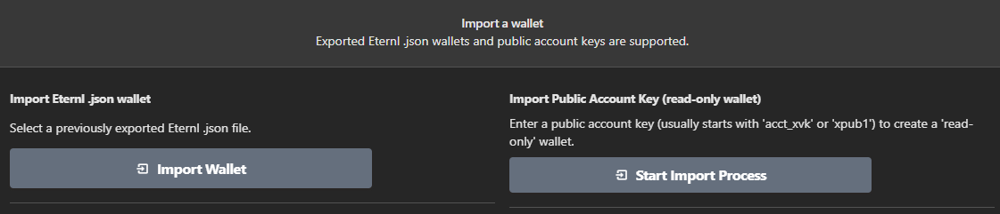<figcaption></figcaption></figure>

* Eternl supports up to 24 accounts (with 24-word recovery phrases upon creation) and you can determine the number of wallets you want to create when you are creating your wallet. The account keys are generated from the root wallet key. \* You can always add accounts after wallet creation, as well. However, each additional account _**increases the syncing time**_ of your wallet.

<figure>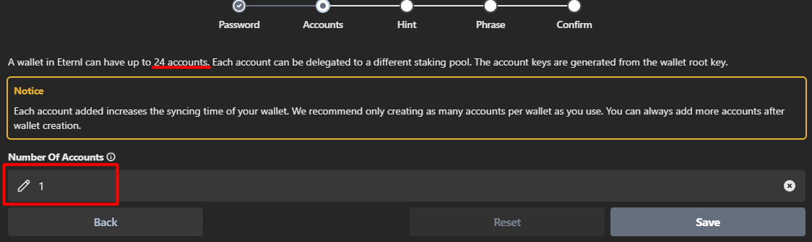<figcaption></figcaption></figure>

* Eternl promotes with having created the first Cardano DApps browser, where you can browse for many DApps from the extension interface.

<figure>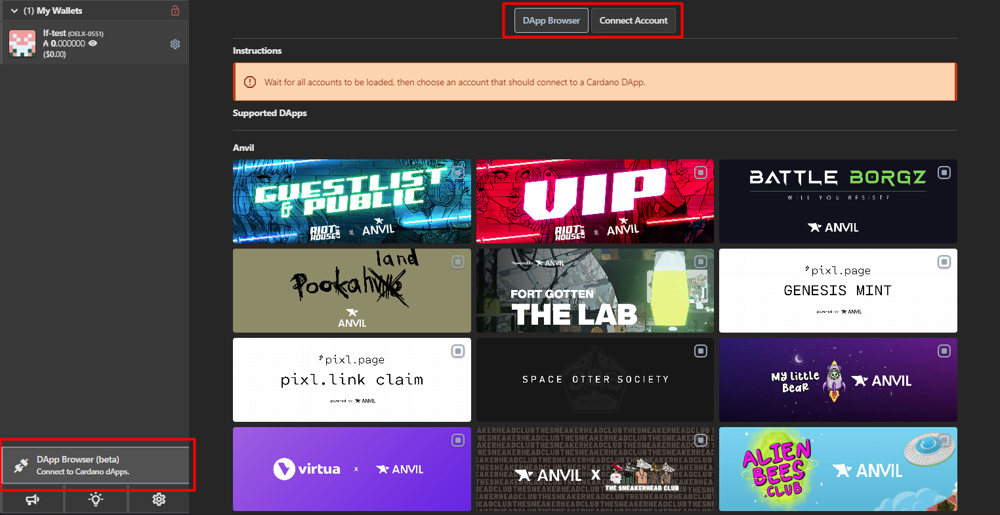<figcaption></figcaption></figure>

* Eternl has NFT support. Can be used to mint NFTs or viewing your collection.

<figure>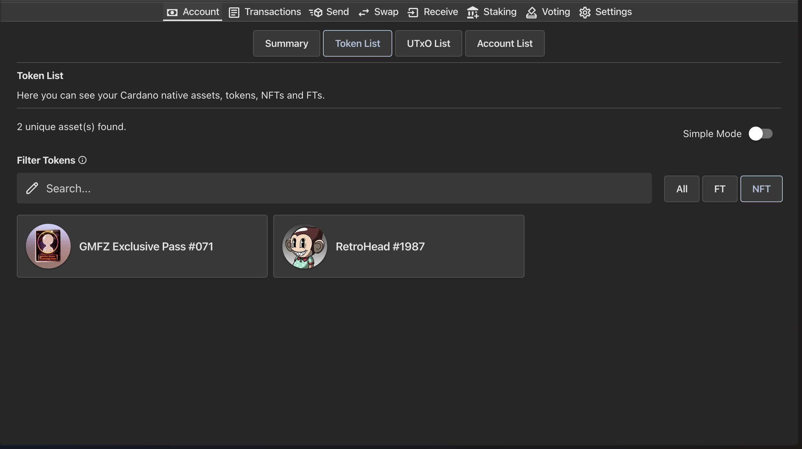<figcaption></figcaption></figure>

* Eternl is NOT Open-Source
* Eternl allows to create an easily readable address book of recipients

### Compatibility

#### Hardware Wallets (Cold Wallets)

* Eternl can pair with Ledger Nano S and Nano X as well as Trezor Model T hardware wallets;

<figure>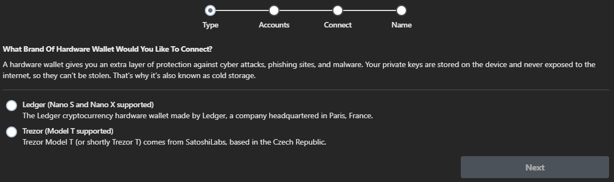<figcaption></figcaption></figure>

#### Software Wallets (Hot Wallets)

* Eternl supports 12, 15, 24 word seed-phrases and is compatible with other Cardano wallets, even Nami if you turn on "Single Address Mode";

<figure>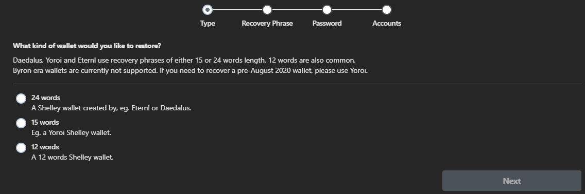<figcaption></figcaption></figure>

### Staking

* Since Eternl is developed by TITANstaking and AHLNET, it is encouraged to delegate your stakes in those pools. However, it is possible to stake in any pool of your choice.

<figure>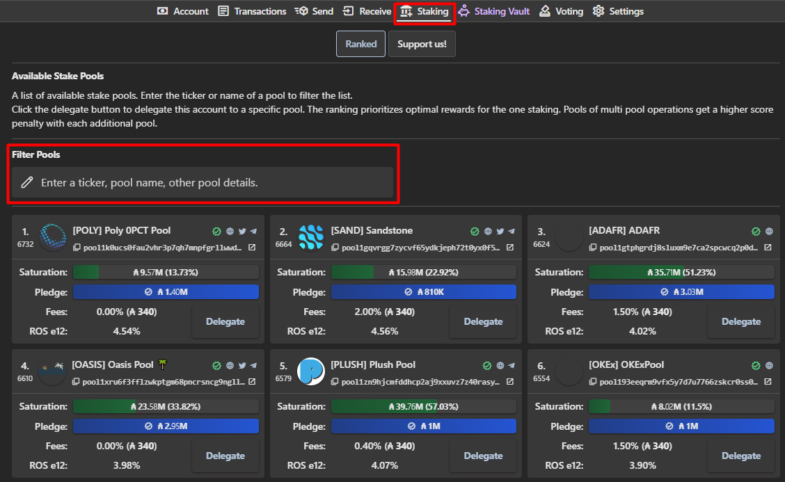<figcaption></figcaption></figure>

* Each account in your wallet (max. 24) can be delegated to different staking pools.
* There is a concept "Staking Vault", that is cancelled due to low interest of ADA holders. You can read details in "FAQ" page under "Staking Vault" tab.

<figure>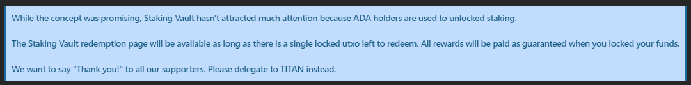<figcaption></figcaption></figure>

### Voting

* Eternl has an extensive page to display staking process and details. You can view the timeline of Catalyst process including related dates and even Challenges, with links to Ideascale

<figure>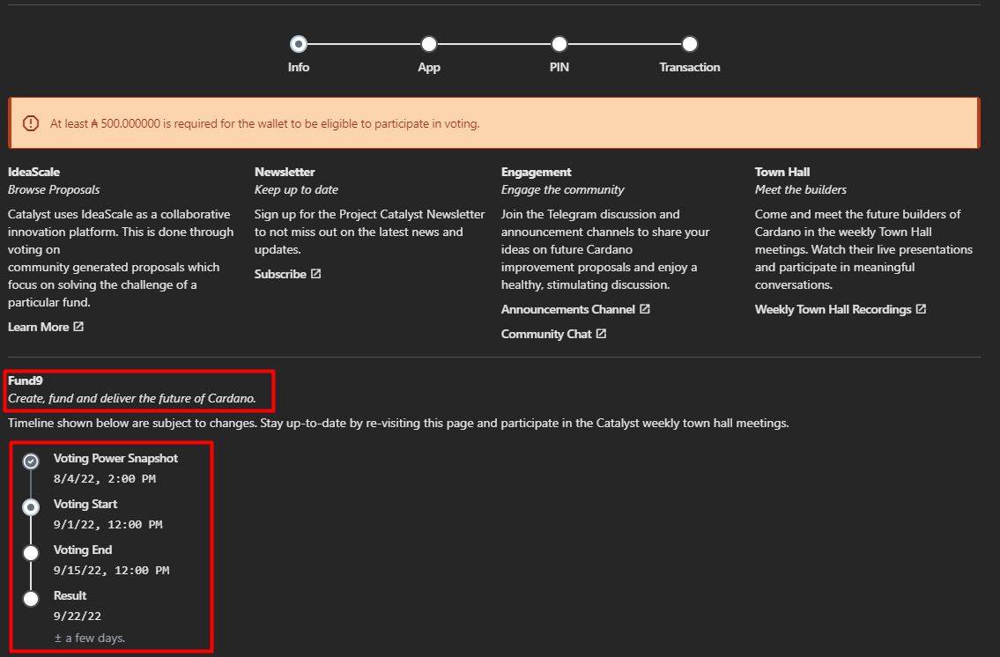<figcaption></figcaption></figure>

### Additional Notes

* If you somehow navigate to https://ccvault.io/, you will see below warning. In case you already had a CCVault wallet, you can migrate following the instructions

<figure><figcaption></figcaption></figure>

* Like most of the wallets, you can change your network to "testnet". Moreover, there are other options in Eternl, listed below.

<figure>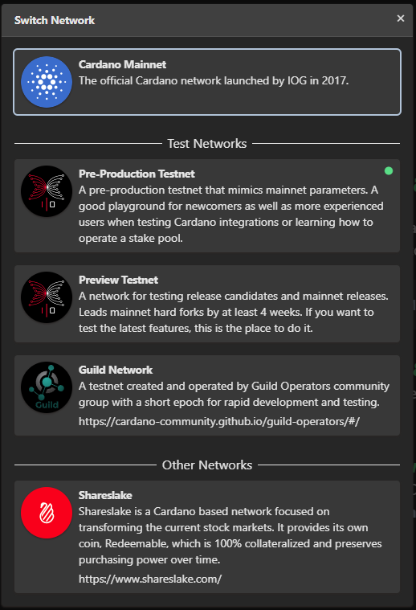<figcaption></figcaption></figure>

* There are many options available under App Preferences you can see blow. We will focus on these on later version of this document.

<figure>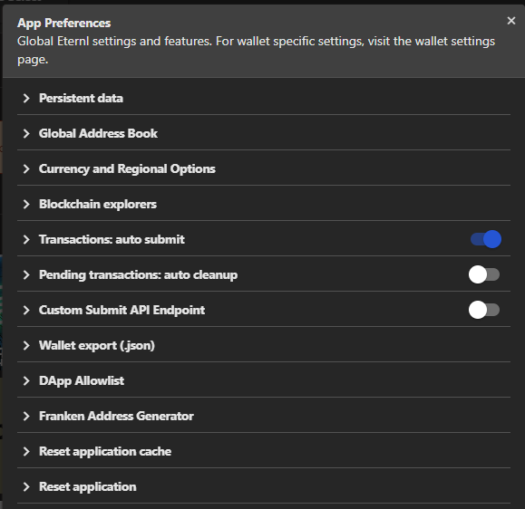<figcaption></figcaption></figure>

* There are many options available under Wallet Settings, which we will focus on next versions of this document.

<figure>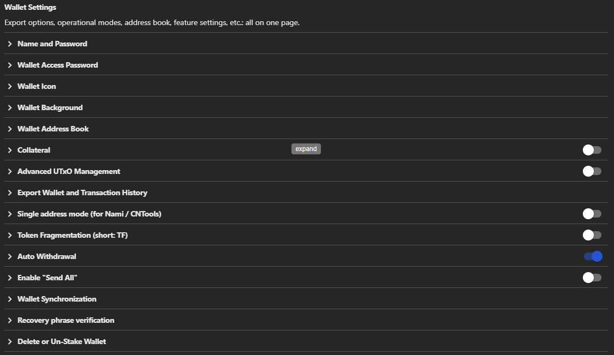<figcaption></figcaption></figure>

### Known Issues

> Please let us know if you encounter any issues

* When Eternl is enabled, Miro ([https://miro.com/](https://miro.com/)) is stuck on loading screen, disabling it from browser extension fixes this issue.

_This means that they **do not** keep a copy of your password or your recovery seed. No one besides you, or anyone you give your password or recovery seed to, will have a copy of these. This means that only you can recover your wallet. If you lose your password and/or your recovery seed then your wallet and funds will be irrecoverable. AFTER COMPLETING THESE STEPS YOU WILL BE WHOLLY, 100% RESPONSIBLE FOR YOUR FUNDS. YOU ASSUME ALL THE RISKS._
