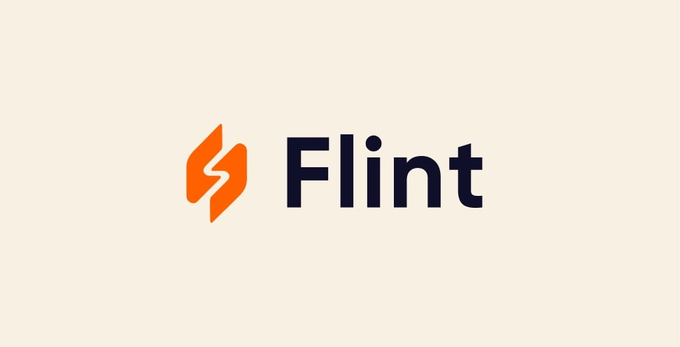
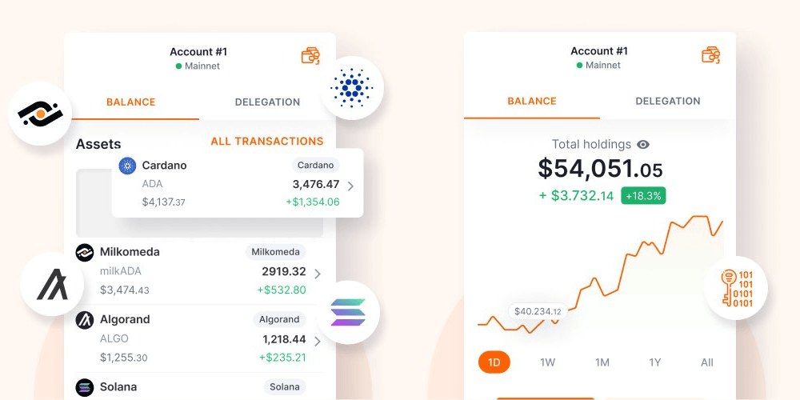
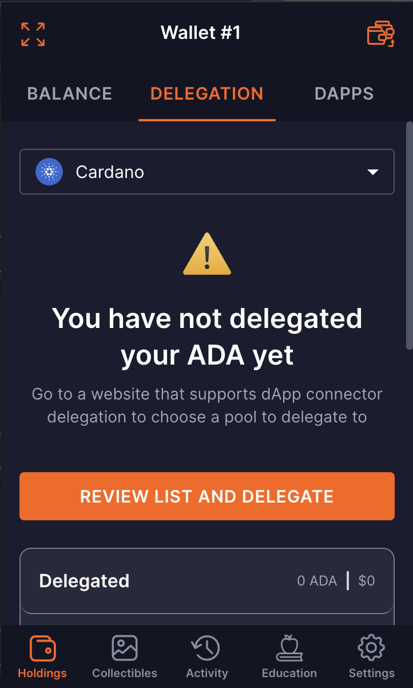
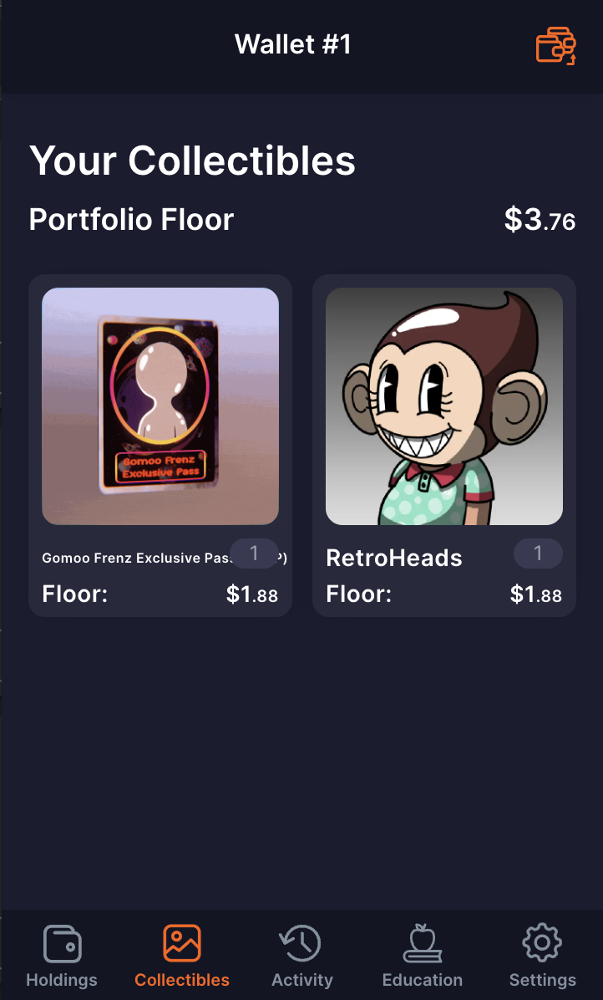

# Flint Wallet

<figure><figcaption></figcaption></figure>

Launched in 2021, Flint is another great option for a Cardano wallet. It has a user-friendly design that makes the whole DeFi and NFT experience smooth and pleasant.

### Availability

It is available on many devices/endpoints

#### Web Browser

Below options are capable as DApp connector & DApp browser;

* Chrome
* Brave
* Edge

#### Mobile

Mobile applications are only available as DApp browser;

* Android
* iOS

### Features

<figure><figcaption></figcaption></figure>

1. Sending, storing, and receiving ada, NFTs, and tokens on Cardano blockchain and the Milkomeda C1 sidechain for Cardano.
2. Delegating to a Cardano stake pool of your choice and withdraw your rewards

<figure><figcaption></figcaption></figure>

1. Interacting with any and all Cardano dApps
2. Hardware support for both Trezor and Ledger hardware wallets via USB and bluetooth
3. Adding and manage multiple wallets in one interface
4. Creating multiple accounts in an individual wallets (these accounts share the same recovery phrase but are not associated with each other on the blockchain)
5. Opening in its own browser tab or as the more typical pop-up extension
6. It supports integration with major dApps, also it has dApp browser

<figure><figcaption></figcaption></figure>

9. Can be used for viewing your NFT collection.

<figure><figcaption></figcaption></figure>

9. The Flint wallet was developed by dcSpark and is open-source.
10. Flint Wallet has testnet support.&#x20;
11. Flint Wallet supports Catalyst Voting.

### Compatibility

#### Hardware Wallets ( Cold Wallets )

* Flint supports Ledger nano S and Trezor model T hardware wallets.

#### Software Wallets ( Hot Wallets )

* Flint supports 15 word seed phrase and App Passcode method on top of provided password and is fully compatible with other Cardano wallets.

#### Connected Apps

* Compability mode allows Flint to inject itself to dApps acting like another wallet even if it is not listed on supported list.

<figure><figcaption></figcaption></figure>

**Example integration with " Minswap "**

1. Go to [https://minswap.org/](https://minswap.org/) and click Launch App button

<figure><figcaption></figcaption></figure>

2. Click Connect wallet button

<figure><figcaption></figcaption></figure>

3. Choose your desired wallet on list

<figure><figcaption></figcaption></figure>

4. Choose wallet you wish to proceed

<figure><figcaption></figcaption></figure>

5. Connected app will appear on Connected Apps page

<figure><figcaption></figcaption></figure>

### Useful resources

1. Creating a new wallet [https://www.youtube.com/watch?v=BicVVL-uRAc](https://www.youtube.com/watch?v=BicVVL-uRAc)
2. Review on what can be done with Flint wallet in general [https://www.youtube.com/watch?v=iOxbkNUKFdg](https://www.youtube.com/watch?v=iOxbkNUKFdg)
3. Delegation [https://www.youtube.com/watch?v=RbWlUYQqk2M](https://www.youtube.com/watch?v=RbWlUYQqk2M)
4. iOS [https://apps.apple.com/app/dcspark-flint-wallet/id1619660885](https://apps.apple.com/app/dcspark-flint-wallet/id1619660885)
5. Android [https://play.google.com/store/apps/details?id=io.dcspark.flintwallet\&hl=en\&gl=US](https://play.google.com/store/apps/details?id=io.dcspark.flintwallet\&hl=en\&gl=US)
6. Browser Extension [https://chrome.google.com/webstore/detail/flint-wallet/hnhobjmcibchnmglfbldbfabcgaknlkj?hl=en](https://chrome.google.com/webstore/detail/flint-wallet/hnhobjmcibchnmglfbldbfabcgaknlkj?hl=en)
7. Github Repository [https://github.com/dcSpark/cardano-backend](https://github.com/dcSpark/cardano-backend)
