# Discord Notification Settings

### Short video on setting up your Discord Notifications

[https://www.youtube.com/watch?v=vjKdpU80hDs](https://www.youtube.com/watch?v=vjKdpU80hDs)

### Setting up Discord Notifications

This document is created to guide you through the following actions:

1. Settings for optimal notifications
2. Never miss anything from a specific channel
3. Audio Notifications

### Setting up for Optimal Notifications

These are the settings used if you are in too many Discord servers and **don’t want to be overwhelmed with notifications**.

**Step 1:**

Setting up universal notification settings for all Discord servers you are on.

1. Click on your profile settings

<figure><figcaption></figcaption></figure>

2. Click on Notifications

<figure><figcaption></figcaption></figure>

<figure>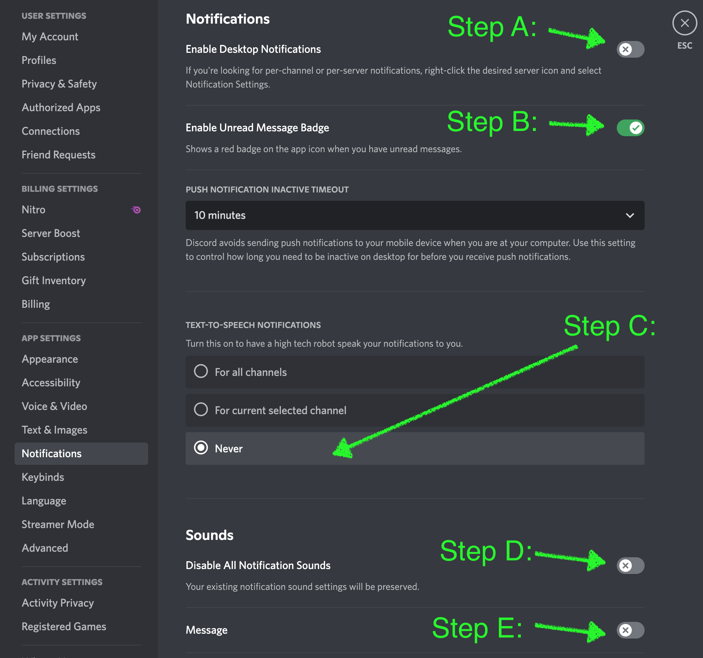<figcaption></figcaption></figure>

**Summary of your actions:**

Disabled Desktop Notifications

Enabled Unread Message badge

Disabled all TEXT-TO-SPEECH notifications

Disabled All Notification Sounds

Disabled Message Notification Sound

4.  Adjusting server notification settings

    Right-click on the specific server → Notification Settings → Choose the options: Only @mentions; Include Highlights (optional); Mobile Push Notifications

<figure>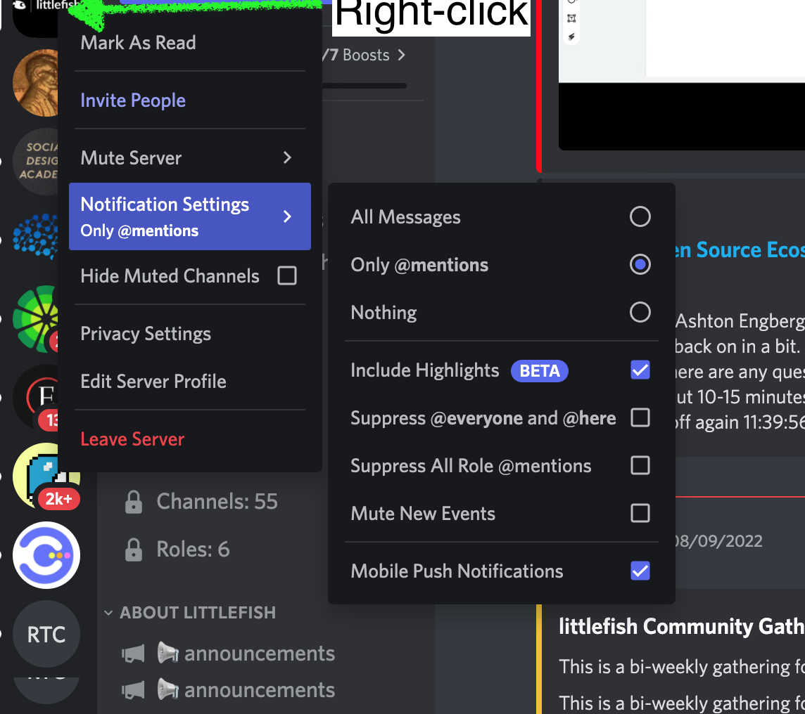<figcaption></figcaption></figure>

Note: ‘Only @mentions’ option for a specific server makes it the default option for all channels in that server.

5. Enable notifications for all messages in channels that are of specific interest to you.

Channels that are strongly recommended in the Littlefish Discord:

* Announcements
* Events
* Action
* Task-board
* New-tasks

Actions: **Go to the specific channel → Right-click → Notification Settings → All Message**

<figure>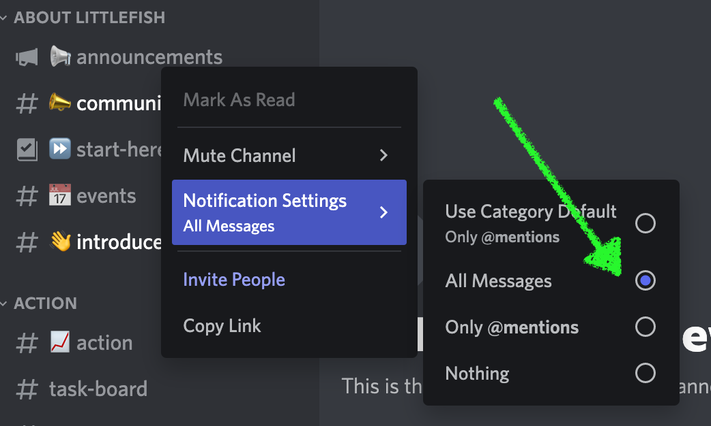<figcaption></figcaption></figure>

Repeat this step for all the channels that interest you.

The End.

### Never miss anything from a specific channel

These settings must be used if the **activity in a specific channel is significant to you**.

_Note: For convenience, we’ll assume that you have already optimized your notification settings._

**Step 1:**

Right-click on the specific channel → Notification Settings

<figure><figcaption></figcaption></figure>

**Step 2:**

Make sure your server notification settings allow for push notifications

Right-click on server → Notification Settings → Mobile Push Notifications

<figure>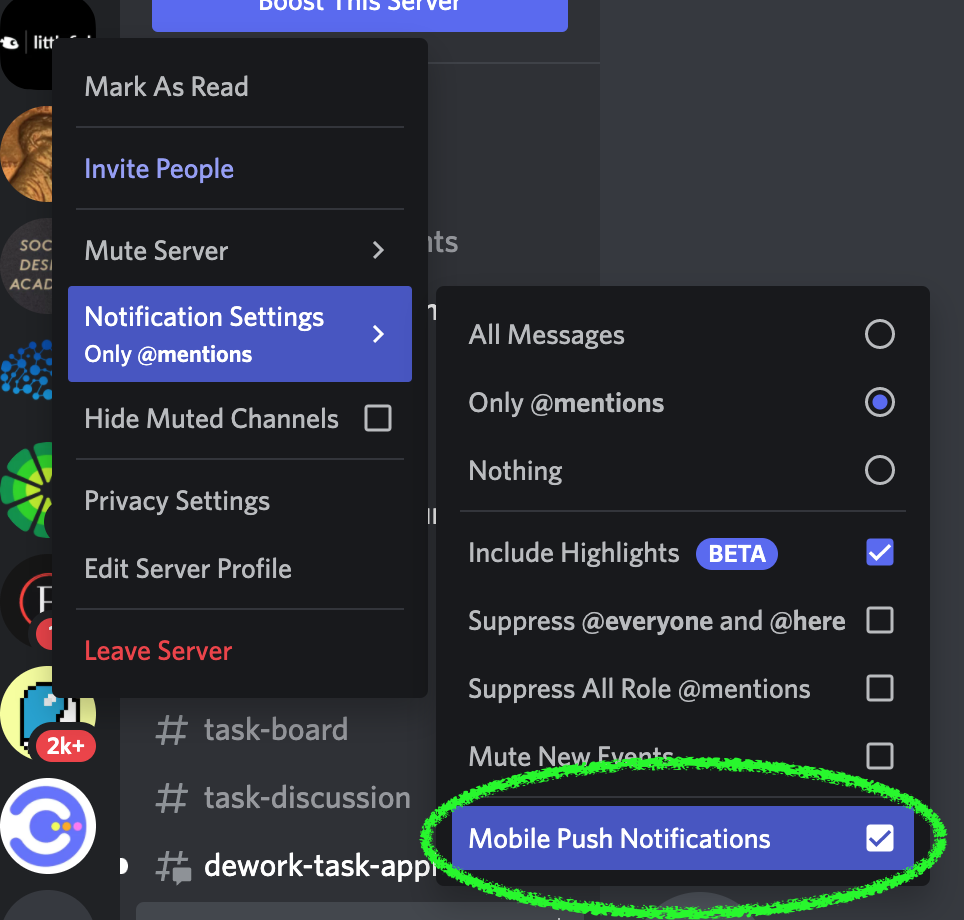<figcaption></figcaption></figure>

**Step 3:**

Enable Desktop notifications in your main profile settings.

<figure>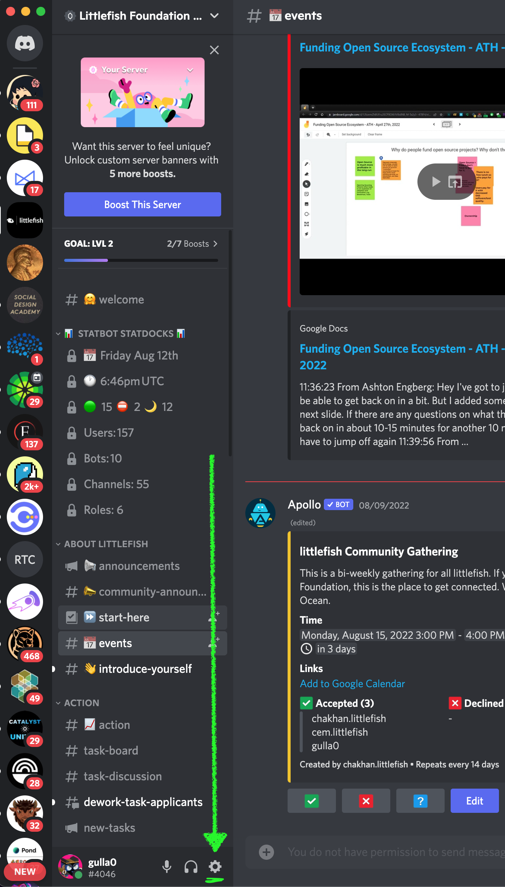<figcaption></figcaption></figure>

<figure><figcaption></figcaption></figure>

<figure>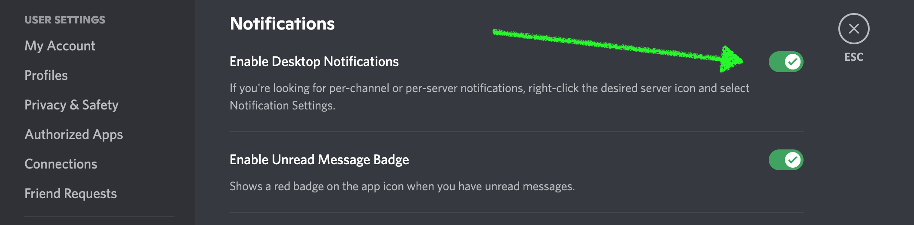<figcaption></figcaption></figure>

Now you will get a Desktop or a mobile notification for every activity on your favorite channel.

_Note: These settings perform best when you have a select few important channels across Discord servers._

_It is best to change the settings for the rest of your servers as follows:_

_Right-click on each individual server → Notification Settings → Disable Mobile Push Notifications_

<figure>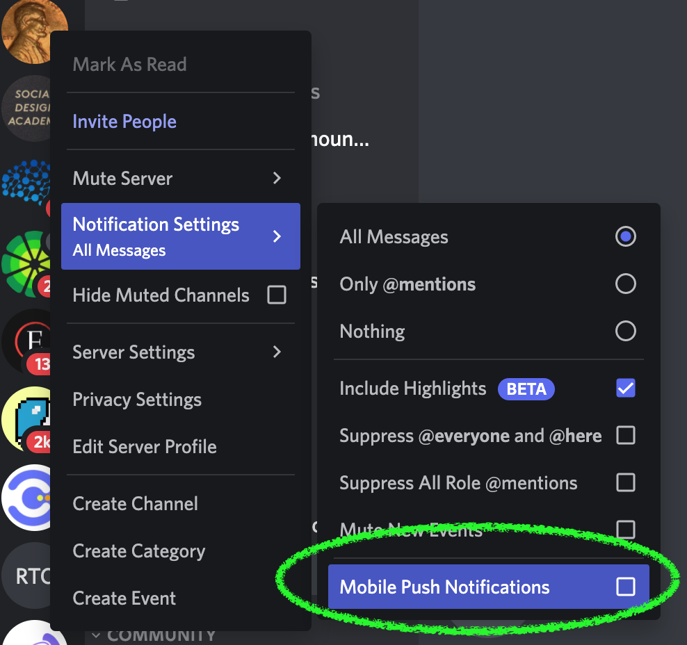<figcaption></figcaption></figure>

The End.

### Audio Notifications

These settings work best when only a few important channels are chosen among all your servers.

**Step 1:**

Enable audio notifications in the profile settings.

Profile Settings → Notifications → Choose settings (follow the picture)

<figure><figcaption></figcaption></figure>

<figure>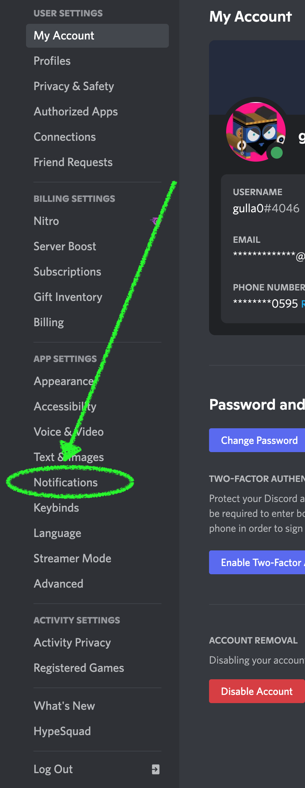<figcaption></figcaption></figure>

<figure>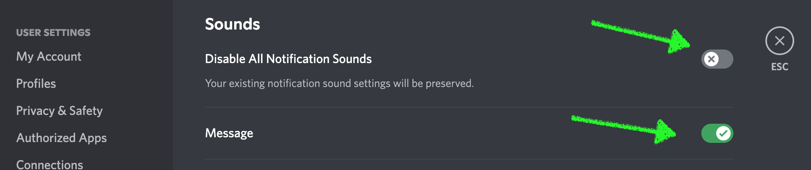<figcaption></figcaption></figure>

Action Summary:

Enabled Message notification sounds. You will hear a sound everytime there is a message in one of your important channels.

The End.

### Bonus Function

Check and adjust notification settings for multiple channels in the same server.

**Step 1:**

Click on the Discord server icon → Click on drop down menu → NotificationSettings → Scroll to bottom of the pop-up → Adjust notification settings for multiple channels (add channel from drop down menu)

<figure>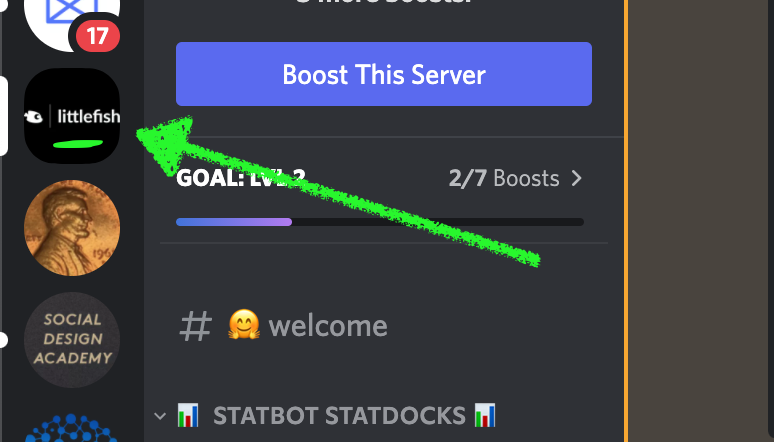<figcaption></figcaption></figure>

<figure>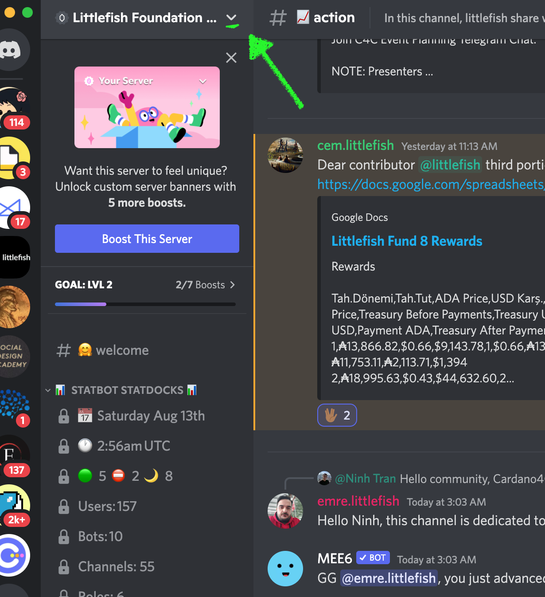<figcaption></figcaption></figure>

<figure>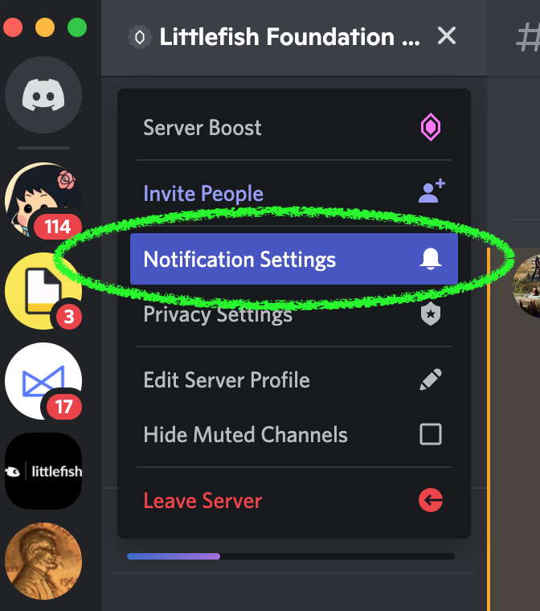<figcaption></figcaption></figure>

<figure>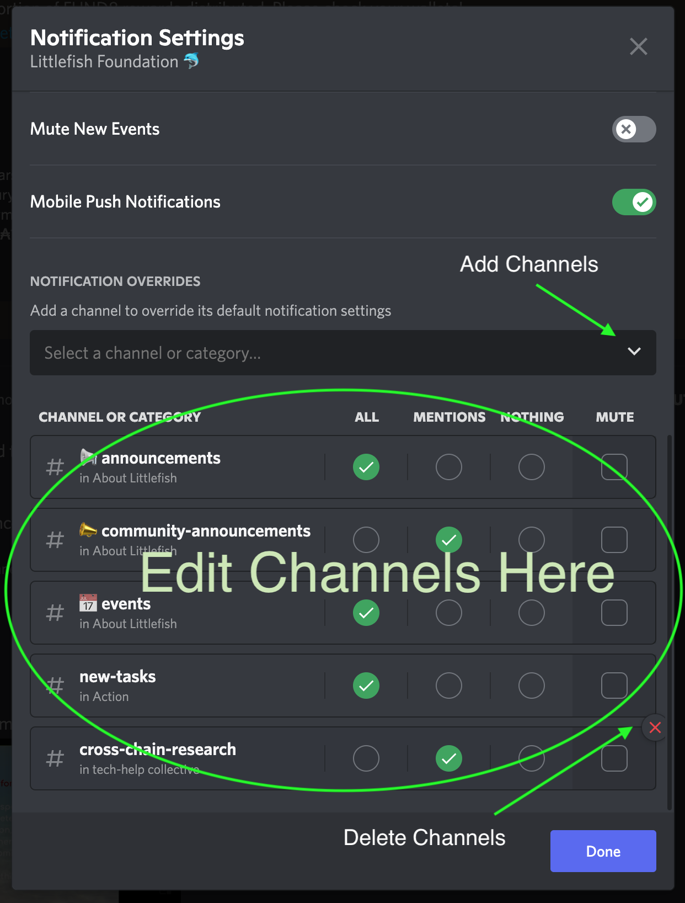<figcaption></figcaption></figure>

The end.
