# Discord Server Analytics

**Tools to Analyze Discord Channels**

**(Aug 15th, 2022; Draft 1)**

Available Options:

1. Discord ‘Enable Community’ Tool
2. Analytics Bot
3. Serverstats Bot (Bonus)
4. **Enable Community Tool:**

Advantages:

* Free and open to use
* Part of discord (not external plugin or bot)
* Displays usage & popularity of all discord channels, individual channel & server interaction insights and many more (List of all insights in images)

Disadvantage:

* Needs a minimum of 500 members in the server to show insights

_Note: If you are the owner of the server, the insights page will display a dropdown menu to choose specific channels and view insights._

_The dropdown menu is not displayed in the images below, because I’m not the server owner)_

Image-view of all server Insights provided:

<figure>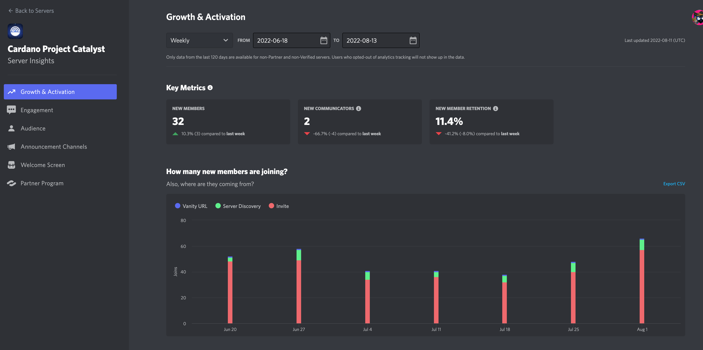<figcaption></figcaption></figure>

<figure>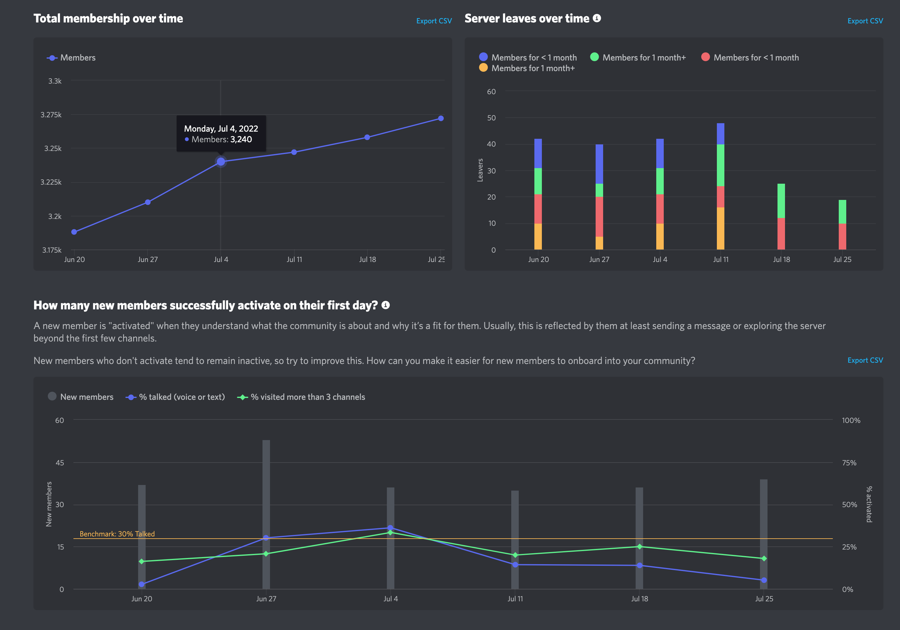<figcaption></figcaption></figure>

<figure>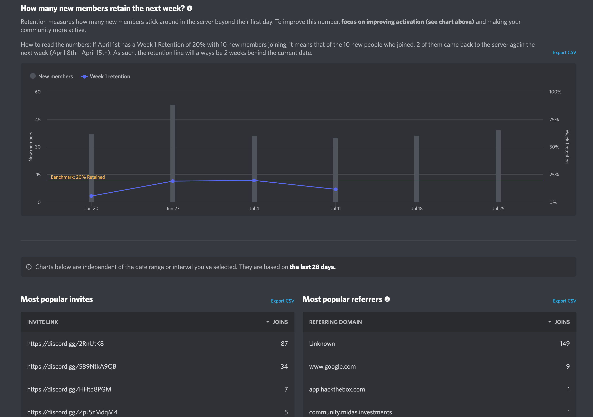<figcaption></figcaption></figure>

<figure>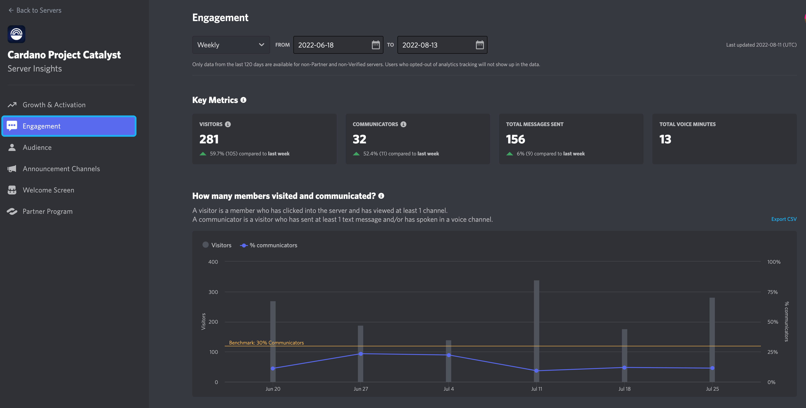<figcaption></figcaption></figure>

<figure>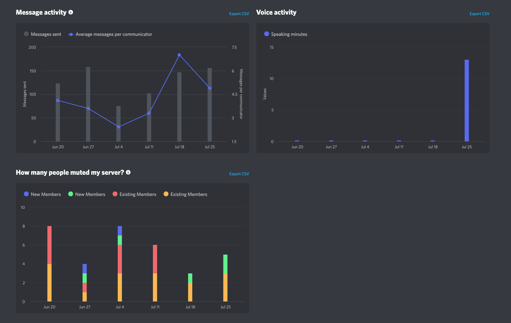<figcaption></figcaption></figure>

<figure>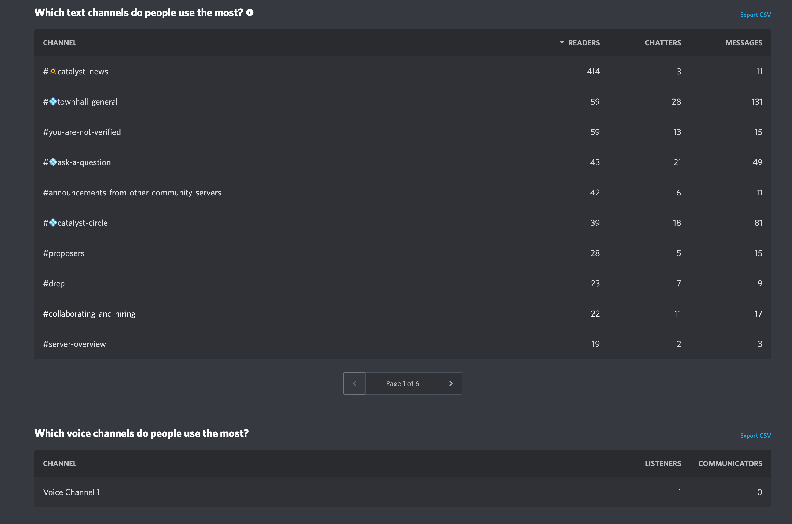<figcaption></figcaption></figure>

<figure>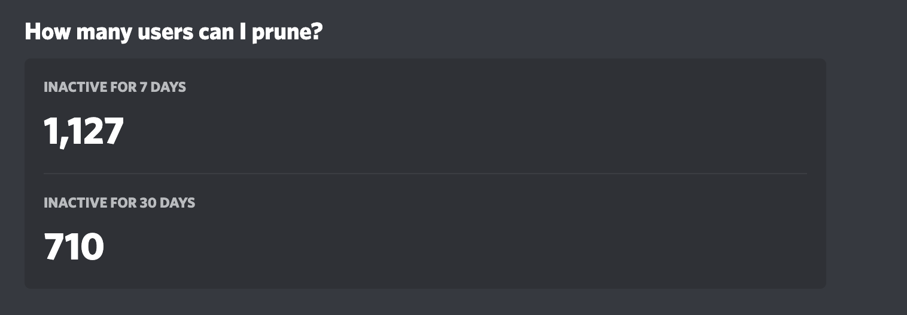<figcaption></figcaption></figure>

<figure>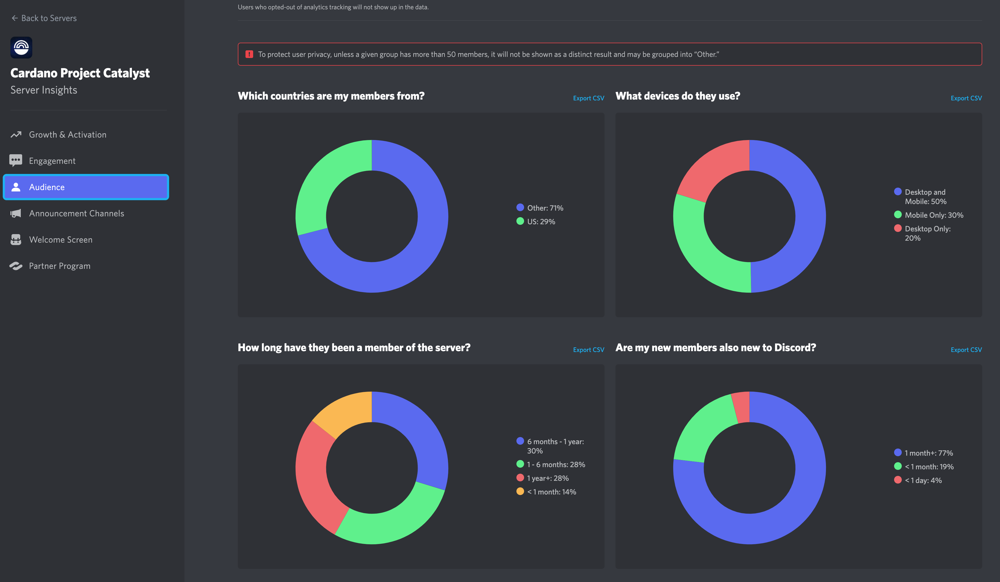<figcaption></figcaption></figure>

<figure>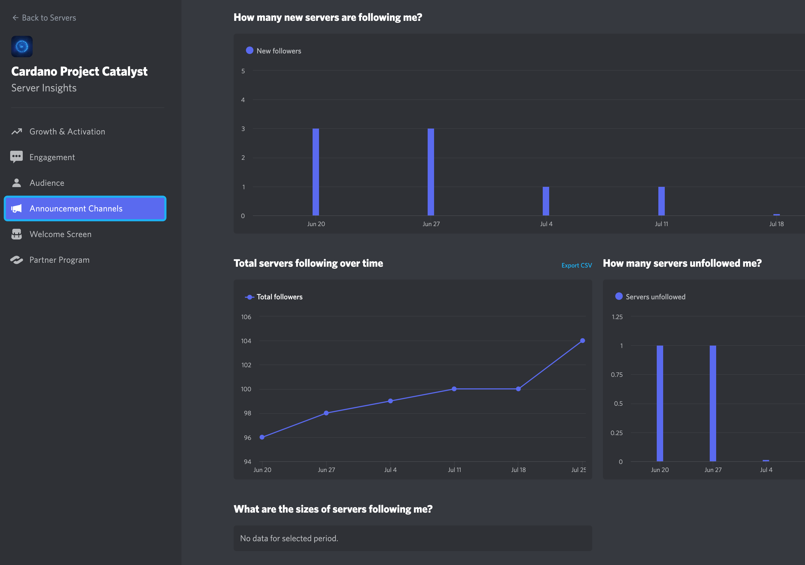<figcaption></figcaption></figure>

**How to set up ‘Enable Community’ tool?**

Link to a comprehensive set-up tutorial. [https://youtube.com/clip/UgkxLWybjZnJFNsHDQbYvk2Q-xqevfAXKtM0](https://youtube.com/clip/UgkxLWybjZnJFNsHDQbYvk2Q-xqevfAXKtM0)

2. **Analytics Bot:**

Advantages:

* Gamifies Discord with individual user data and activity (Image: SA\_10)
* Customizable leader boards based on points assigned for specific actions (Image: SA\_11)

Disadvantage:

* Users have no control over their data

Website: [https://analytics-bot.com/#page-top](https://analytics-bot.com/#page-top)

_Individual User Data:_

<figure>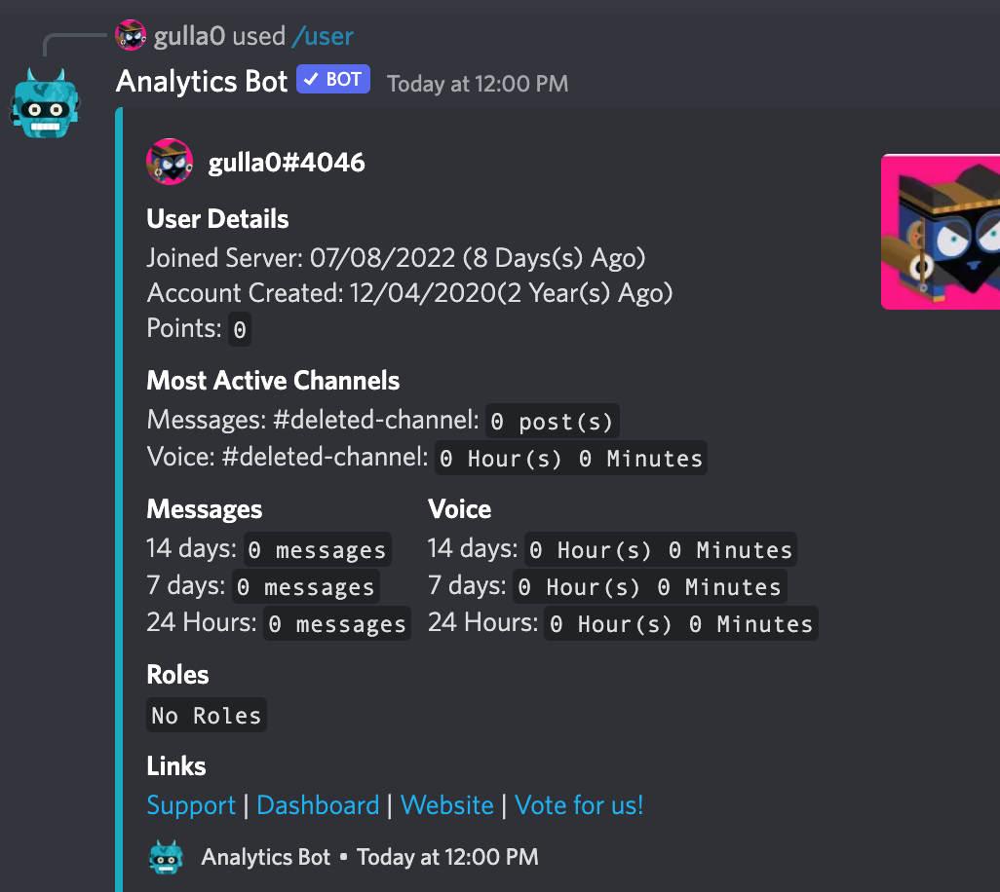<figcaption></figcaption></figure>

_Bot Capabilities & Action Commands:_

_Note: Use slash commands_

<figure>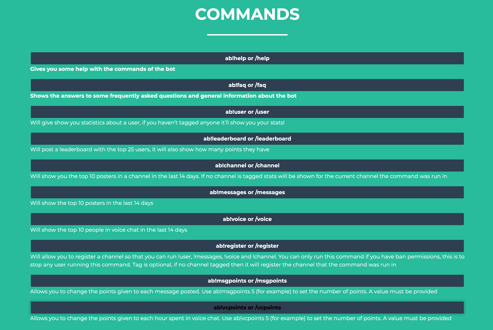<figcaption></figcaption></figure>

**Setting up Analytics Bot:** (Follow these steps)

Website ([https://analytics-bot.com/](https://analytics-bot.com/)) → Invite to Server → Choose Server → Continue → Authorize → Make sure the bot is in the server → Use with ‘/’ commands.

Invite to Server

<figure><figcaption></figcaption></figure>

Choose Server

<figure>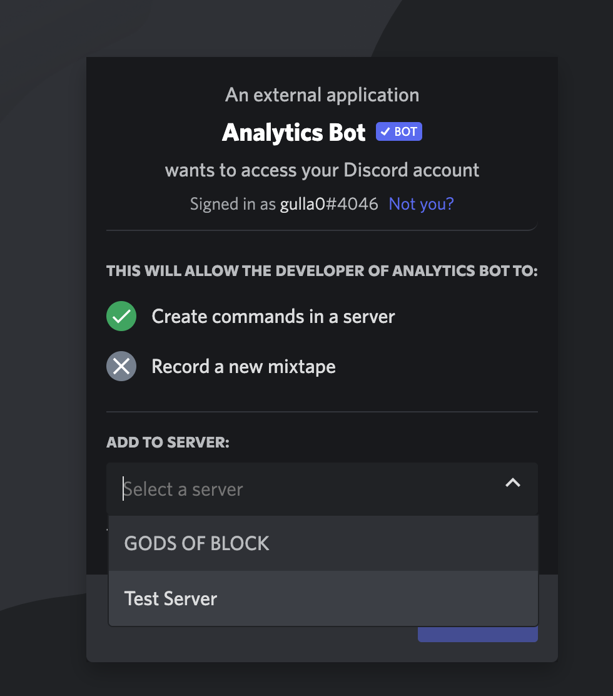<figcaption></figcaption></figure>

Continue

<figure>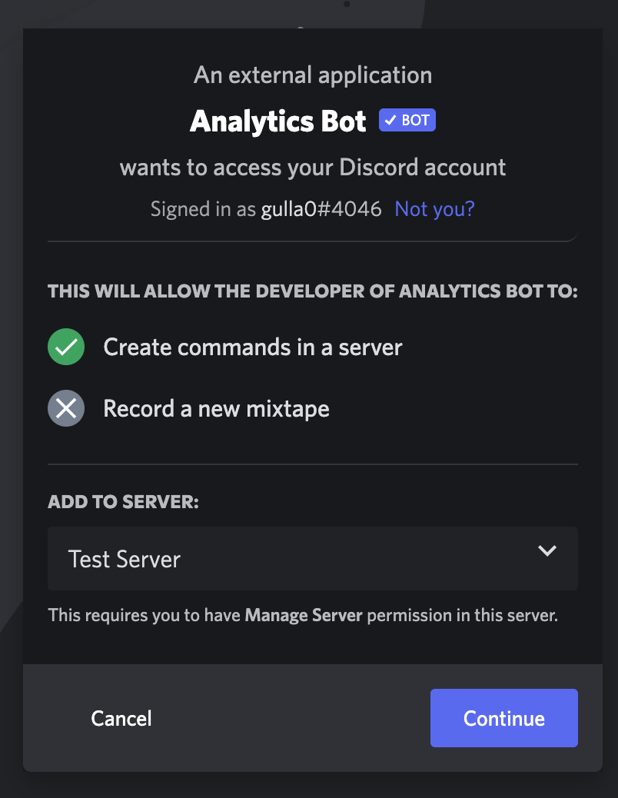<figcaption></figcaption></figure>

Authorize

<figure>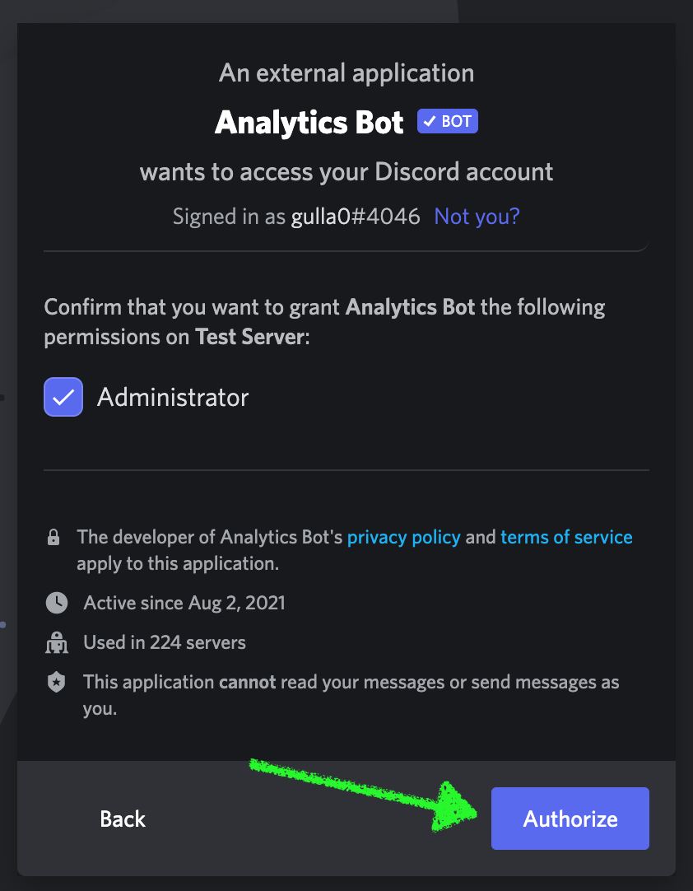<figcaption></figcaption></figure>

Check for Analytics Bot in your server

<figure>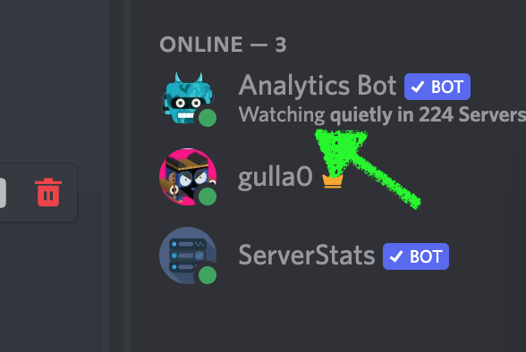<figcaption></figcaption></figure>

Start using '/' commands and choose from suggestions

<figure>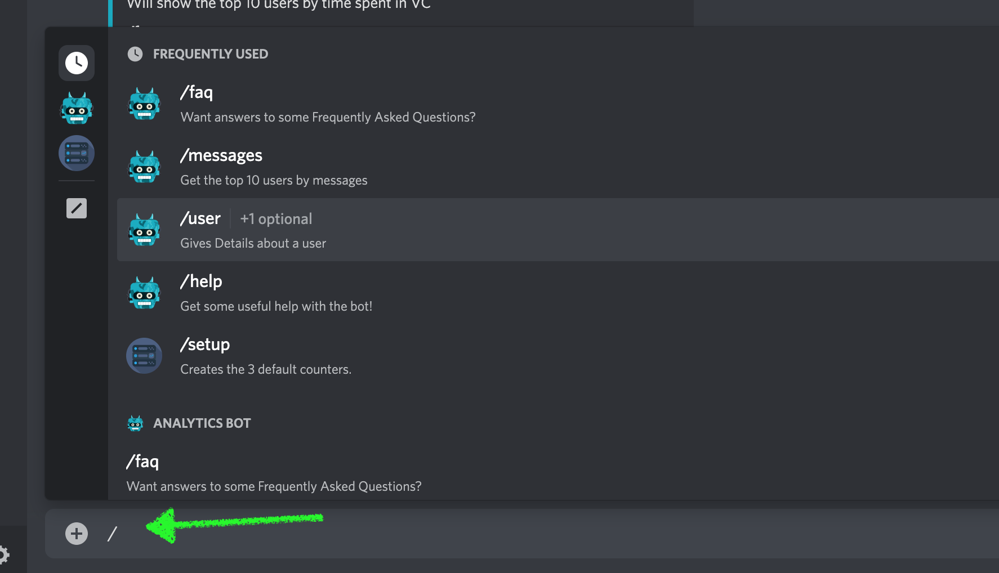<figcaption></figcaption></figure>

3. **Serverstat Bot (Bonus)**

How to set up and utility?



Command List & Functions:



### Why Does DAOs Need Discord Server Analytics?

_**DAOs need Discord server Analytics because:**_

1. **Improves Engagement:** It provides insights that can help DAOs measure engagement in their Discord. Come to think of it, engagement is the life blood of any online community. We’ve all been there! It almost feels like a superpower when you see individuals interaction with your Discord announcements, join events, community calls, or scream at funny memes - this literally means that your community members are resonating, engaging and they find your community interesting.
2. **Make Better Decisions:** Secondly, it's obvious that community building and team management are difficult tasks to handle. Sometimes, it's difficult to tell when a decision you're making is based on hard evidence. Thank goodness, Discord server Analytics make DAOs decision-making process easier with the peace of mind that they're backed by existing data. For greater benefits, Discord server Analytics display data that allow DAOs to see trends - this trend is insightful, it may lead to drastic improvements to their Discord server.
3. From a bird’s-eye view, Discord server Analytics help DAOs quickly Identify peak activity times and days to optimize content delivery and event schedules. Clearly, everyone has different schedules and different time zones! DAOs need Discord server Analytics so as to help them optimize content and maximize engagement. Just like social media platforms, there are specific time your target audience would likely be online. Say you’re running a social media campaign, understanding this metric will make your Ads perform better.

> Discord server Analytics are no different! It provides data about how your members are interacting with your channel - this will give you a clear sight into how to schedule your next meetings and to tailor content and engage users effectively.

### Why Is Discord Server Analytics Important For DAOs?

1. Discord server Analytics is so power to the extent of analyzing user engagement patterns. How? It provides information such as the most frequently visited channels on your server or topics of interest. Additionally, this tool also plays a pivotal role when it comes sentiment analysis. This data is paramount while also enabling DAOs to understand how their members feel about the community, and identify areas for improvement.
2. Another revolutionary importance of Discord server Analytics is that the insights gathered can be used to improve DAO onboarding process. With Discord server Analytics, DAOs can know where users dropped off while trying to join their Discord - Truth be told, individuals want something straightforward, onboarding should be simple as possible, user-friendly and engaging. Equally, Discord server Analytics will enable DAOs to monitor user retention rates and implement strategies that will increase long-term engagement in their Discord.
