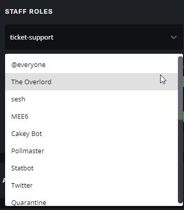
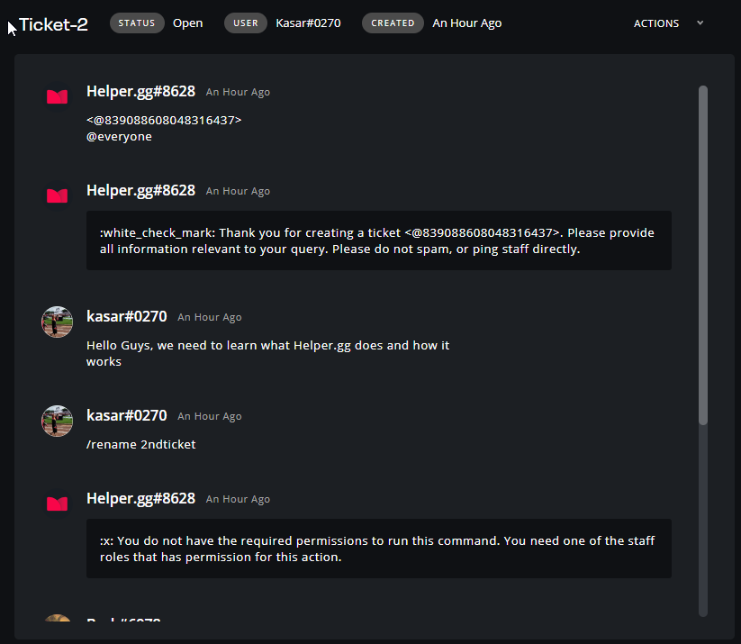
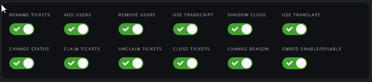
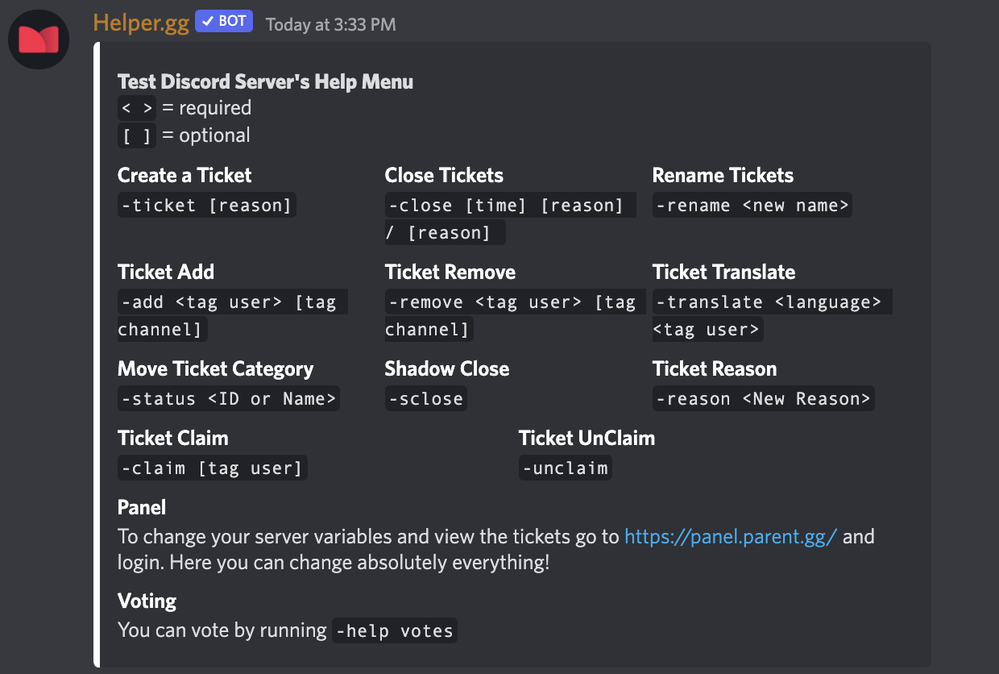
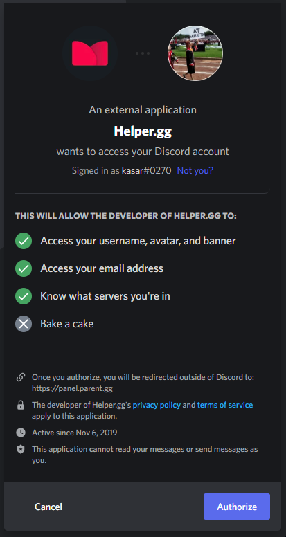

# Helper.gg - How to

It is a subsidiary of "Parent.gg" project.

Panel FQDN = https://panel.parent.gg/

## What is it?

```
Helper.gg is a multifaceted, highly advanced Discord integration: designed to facilitate communication between support teams and their clients through the use of a ticket system. Of course, there are several bots out on the market that operate on the same premise, but every system has its share of flaws
```

Ticket Tool is a Discord bot that lets users raise tickets on issues they are facing on your Discord server. Often time, users might face some challenges while trying to interact with your server. [Helper.gg](http://helper.gg/) was created for a purpose, it helps community members to easily ask questions and queries that they might have in one channel, Instead of discussing them across the server. Significantly, this bot was built to hide ticket away from every other member in the channel, this makes things more structured on the server.

[Helper.gg](http://helper.gg/) is basically a secretary for your discord server. Nonetheless, this secretary does its job by helper members find the right direction whenever they encounter any problem on Discord. A bot like [helper.gg](http://helper.gg/) is extremely useful for large community servers where their moderators would often encounter technical difficulties. DAOs need a bot like this to help them create support tickets for the right parties. Helper.gg streamlines communication of a team with other teams and end-users. Developers of the bot boldly stated that they created this to address "flaws and shortcomings" of other bots are in the market.

## Administration

### Panel

* Staff accounts authorized through the panel ([https://panel.parent.gg/](https://panel.parent.gg/)) can alter Support, Management, Billing, Purchasing, Sales etc.
* After authorizing Helper.gg on your discord, it automatically pulls roles from your guild;

<figure><figcaption></figcaption></figure>

* You can see created tickets through the panel and close them using the "Actions" menu;

<figure><figcaption></figcaption></figure>

### Discord

* Free members can have 3 staff roles (interchangeable on the panel) and Premium members can have 20 staff roles. Below are the permission table of Discord Support Roles that you can assign to support team members;

<figure><figcaption></figcaption></figure>

## Features

### Free of Charge

* One advantage of Helper.gg is that it provides "zero-setup" feature on Discord's end. But you still need to configure the panel to suit your needs.
* It is compatible with "Discord Roles" when dealing with tickets, providing features like;
  * Rename
  * Add
  * Remove
  * Transcript
  * Translate etc.
* You can politely ask users in the guild to stop spamming. (Miscellaneous Messages > Please Stop Spamming)
* You can set a goodbye/farewell message which Helper.gg will post in the ticket indicating that the user created this ticket has left the guild. (Automation Settings > Message on User Leave)
  * This is especially good for pinpointing unsatisfied end-users and improve your customer relations/support.
* You can use "Ticket Tags" to categorize the tickets you receive for a cleaner environment.

### Premium

* There's an option to automatically remove tickets if the user, who created the ticket, leaves your guild under "Automation Settings > Close Tickets When User Leaves". This might be handy for you to get rid of piling tickets.
* You can set a timeout for a ticket to automatically close unless there's a response in predefined hours. (Automation Settings > Auto Close Tickets After No Reponse\* (Hours)) (\*Yes, there's a typo in the panel)
* There's an auto-delete feature for messages in seconds, requiring auto-close to be enabled.
* You can also change color of your messages with HEX codes (e.g. FFFFFF)
* You can limit special characters in user messages except '-' if you want to.
* You can prevent users from creating spam tickets.
  * > Mechanism here is not explicitly defined
* Bot can tell how much time in seconds until the server is banned due to spamming
* You can gather transcripts of the closed support ticket through email, Discord server or DM for benchmarking purposes.

## Usage

### Commands

> \-ticket "Reason" > This creates a new channel with "ticket-(numberoftheticket)".&#x20;
>
> \-rename > renames the automated "ticket-#" convention easily.
>
> \-add @user or role" > Allows you to add user(s)/role(s) that you wish to the ticket.
>
> \-remove @user or role" > Removes user(s)/role(s) from the ticket.
>
> \-status {id} or "category" > Moves ticket to predefined ID's and categories.
>
> \-reason {reason} > Adds reason to the ticket if it's not already present.
>
> _**-translate {language} @user > Automatically translates the ticket to your language and reply to user's language. This is a quite useful one**_
>
> \-claim/unclaim > Staffs with "Claim Tickets" permission use this command to claim the ticket, vice versa.
>
> \-close (Reason) > Obviously, closes the ticket. You can optionally ask for user confirmation, too.
>
> &#x20;  \-sclose > Closes the ticket and removes everyone from the ticket. Good for archiving important knowledgebase.
>
> &#x20;  \-help > Displays the help menu as below

<figure><figcaption></figcaption></figure>

For more detailed information regarding commands; https://docs.parent.gg/commands/

#### Known Issues

* Almost every time you connect to the panel, it asks you for authorization, which is quite annoying.

<figure><figcaption></figcaption></figure>

### Why DAOs Need [Helper.gg](http://helper.gg/) <a href="#why-daos-need-helpergg" id="why-daos-need-helpergg"></a>

1. **Community Management and Moderation:** It is clear that Discord servers usually have rules that users must adhere to. DAOs need a bot like [Helper.gg](http://helper.gg/) to enable their members raise tickets when other users violates these rules.\
   To make things more organized, the bot can help DAOs to categorize tickets based on the type of issues, For example, inappropriate content, abuse, and more. DAOs need this bot since it helps their team to address these issues in an effective way.
2. **Technical Assistance:** [Helper.gg](http://helper.gg/) is a useful bot that can help DAOs that offer special services to customers (e.g, it could training users to use their learning platform or voting system, whatever the case might be), their users might encounter technical problems along the way. This bot will help DAO team members to handle those technical issues more effectively.

### Why is [Helper.gg](http://helper.gg/) important for DAOs <a href="#why-is-helpergg-important-for-daos" id="why-is-helpergg-important-for-daos"></a>

1. For instance, you visit a website and it’s taking forever to load, you’d probably hit the back button or go to another website right? Your Discord members are like people who visit different web pages, they might leave your Discord and never come back. Having a bot like [Helper.gg](http://helper.gg/) on our Discord will help enable our members to easily lay down complaints.
2. [Helper.gg](http://helper.gg/) is important for DAOs since it serves as a medium through which community members can reach out to the admin regarding any channel that needs proper attention. Decentralized organizations need a bot like [Helper.gg](http://helper.gg/) to help their team members receive feedback on how well their Discord is performing and if it’s serving the purpose.
