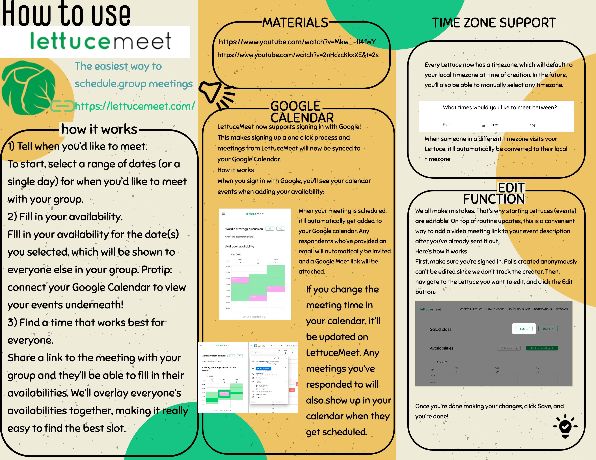

# How to Use lettucemeet



**Author:** Frank Chukwurah\
**Date:** 15/08/2023

&#x20;Comment

### Introduction 

To be begin with, not all scheduling apps are created equal. At a glance, Lettucemeet looks so good! When it comes to meeting scheduling, Lettucemeet is a platform that should come to mind; anyone looking for the easiest way to schedule group meetings can leverage this platform - It is 100% free to use, individuals can use the platform without creating an account, and it can easily be integrated with Google calendar!

### Explain the scheduling problem of DAOs 

At a first glance, its obvious that planning meeting might seem like a straightforward task. Yes! It doesn’t require automation. But as DAOs activities pile up, and meetings become more frequent, proper time management is important to avoid one being overwhelmed. More so, DAOs contributors are residing in different parts of the world - simply put, everyone, has different schedules, different time zones and most of their free times overlap someones meetings!

_**The paragraphs below explains how an individual can use Lettucemeet!**_

<figure><figcaption></figcaption></figure>

### How to use this tool? Comment 

1. To start scheduling your meetings and events, simply navigate to [**lettucemeet**](https://lettucemeet.com/), and click the “**Try it now**” button. Once the page loads, you’ll be prompted to choose a range of dates, or a single day when you’d like to meet with your _**group or one-on-one meeting with someone**_; hit the “**Let’s Meet**” button to proceed to the next page.

2. Enter a name for your meeting and briefly describe what your meeting is about; select what time you would like to meet between, select what type of meeting you’re hosting (group meeting or one-on-one), and lastly tweak “**Limit scheduled meeting time**” to suit needs. Finally, hit the **Create** button and viola - it’s that simple - copy your meeting link and share with your team!\
   

### Why DAOs need this? 

1. Thankfully, an appointment scheduling software like Lettucemeet is needed by DAOs and business professionals to schedule their meetings, and manage their availability to the highest peak. To eradicate “**the scheduling problems of DAOs,**” DAOs need this scheduling tool to save time, stay organized and get in touch with their team members.

> Not only does Lettucemeet save time, it enables DAOs have complete control over their availability while also providing a better experience for their team members.

2. To make sure your meeting scheduler works for you and not against you, chances are, there might be a few important scheduled meetings you don’t want to miss but, they’re still lingering on your Google Calendar - DAOs needs a tool like Lettucemeet to help them avoid losing sight of any meeting, events, or community calls because it integrates smoothly with Google Calendar and Outlook.

### Why is it important for DAOs. 

1. Meeting scheduler like Lettucemeet is a game changer and it will significantly help to enhance employee’s experience!\
   DAOs that leverages online scheduling solution to schedule meetings, will do themselves a favor while also offering a smooth employee experience. Additionally, this tool is important to DAOs because it’s easy to use whilst making meetup convenient for everyone.
2. Since everyone has different schedules and time zones, Lettucemeet helps individuals to avoid being overwhelmed with impromptu meetings - This tool is also important and responsible for helping DAOs reduces the number of No-Shows - Just imagine you have placed yourself in the best lighting you could find, and then… none of your team members doesn’t join the call? It’s heartbreaking! To avoid any sort of embarrassment, the Lettucemeet platform gives users the opportunity to edit and reschedule their meetings beforehand, and with Google Calendar and Outlook integrations, they will remember they have an appointment to catch up with.

**Additional Links**

* [Lettucemeet.com](https://lettucemeet.com/)
* [Alternativeto.net](https://alternativeto.net/software/lettucemeet/)
* [Medium.com](https://medium.com/lettucemeet/connect-with-google-ef885bc17204)

**Twitter Profile**

* [https://twitter.com/cjfrankie\_13](https://hackmd.io/%E2%80%94twitter.com/cjfrankie\_13)
