# Recurring Events on Discord with Apollo Bot

**Overview of Apollo Bot**

The event shows up on the channel you specified and there is a chance that members can miss out if they scroll past it or if they don’t browse that specific channel.

Apollo Bot exists to be one of the best calendar and event bot for Discord. It was designed to offer a powerful all-in-one package for all your event planning with attendance tracking needs too.\
Not just that, some of the notable features include, recurring events, magic time zones, event reminders, role based sign-ups, and more.

### **What Apollo Bot Can DO**

1. One-click sign up
2. Recurring events
3. Event reminders
4. Choosing time zone
5. Can link to Google Calendar

### **How to Use Apollo Bot**

**Step 1:**

Go to the website:

[https://apollo.fyi/](https://apollo.fyi/)

**Step 2:**

Click on ‘GET APOLLO’ at the bottom of the landing page.

<figure>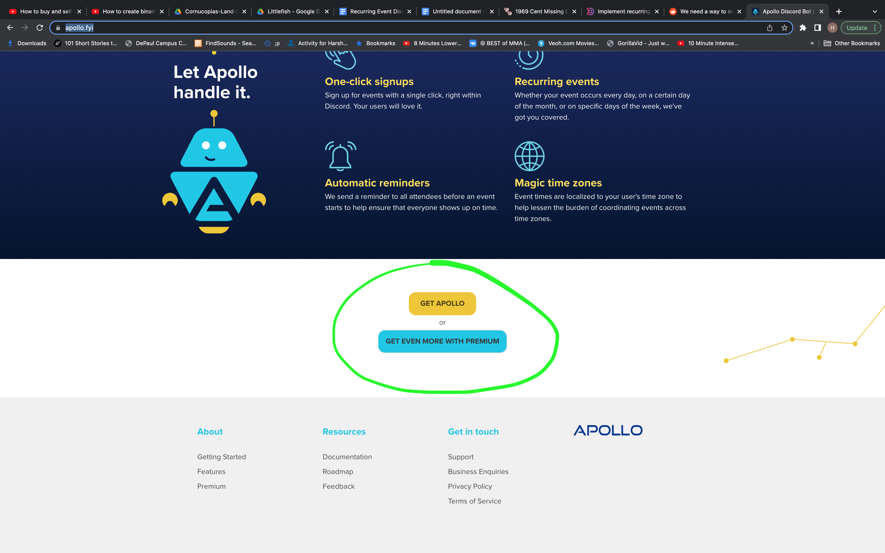<figcaption></figcaption></figure>

**Step 3:**

Choose Server.

<figure>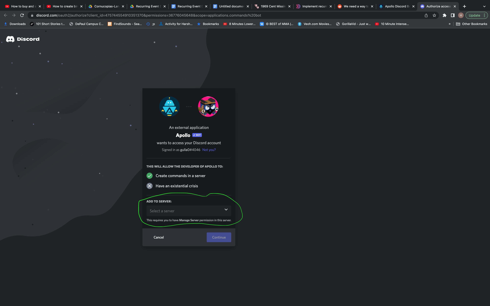<figcaption></figcaption></figure>

**Step 4:**

Authorize Bot permissions

<figure>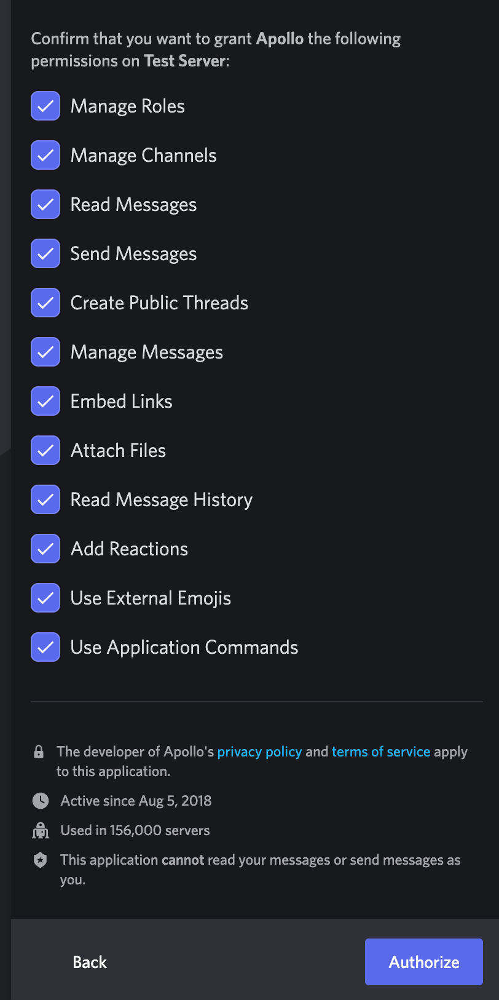<figcaption></figcaption></figure>

**Step 5:**

Confirm proof of human with one click in the next screen and go to your Discord server.

**Step 6:**

Apollo uses ‘/ commands’.

Type ‘\_/event’ \_to set up your event.

The bot sends a private message to you with directions for creating the event.

<figure>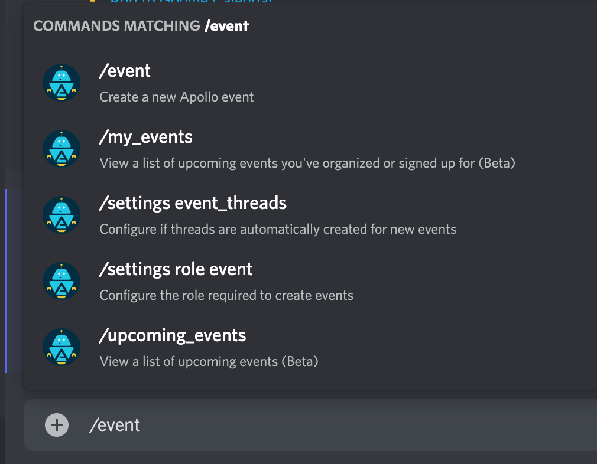<figcaption></figcaption></figure>

**Step 7:**

Set up the event by answering the bot questions.

<figure>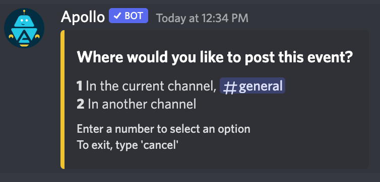<figcaption></figcaption></figure>

<figure>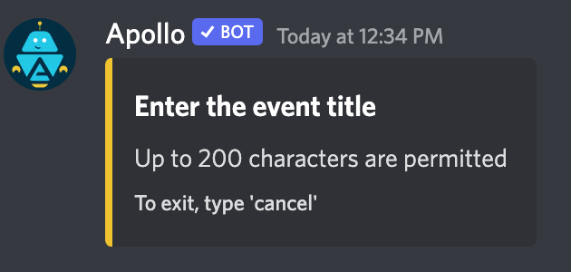<figcaption></figcaption></figure>

<figure>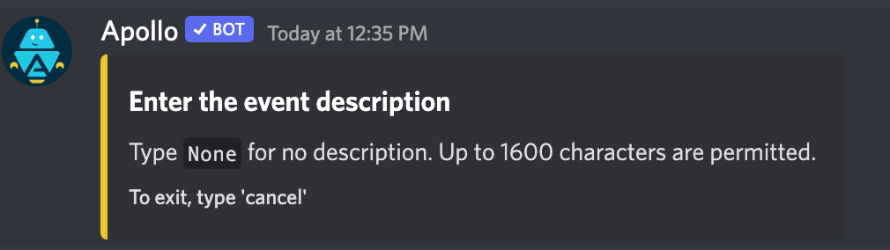<figcaption></figcaption></figure>

<figure>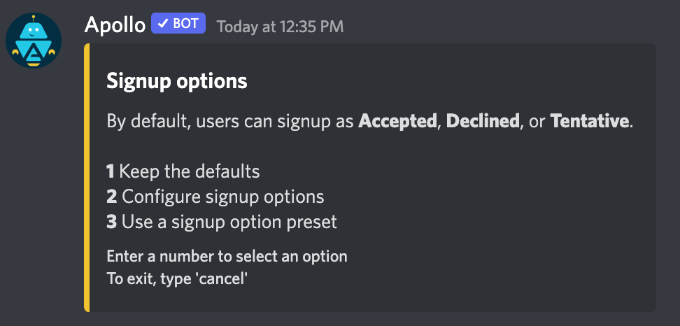<figcaption></figcaption></figure>

<figure>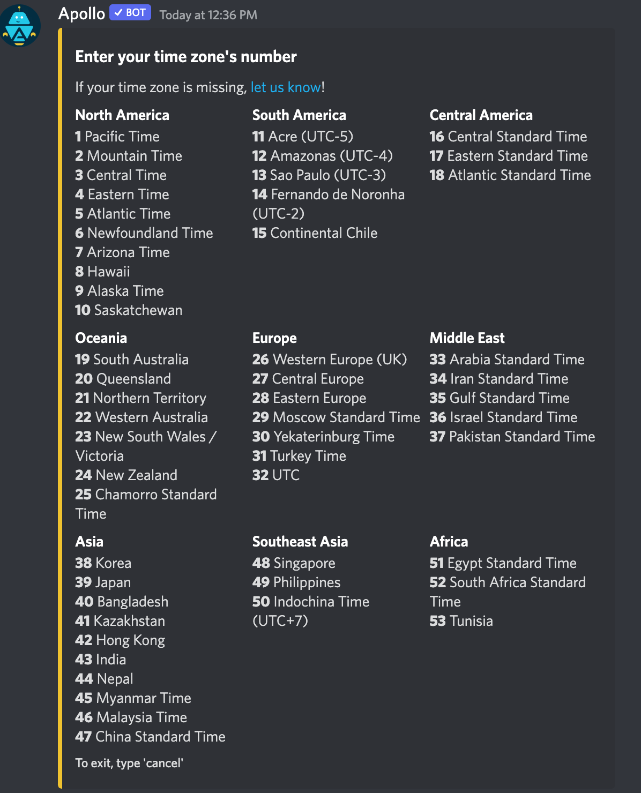<figcaption></figcaption></figure>

<figure>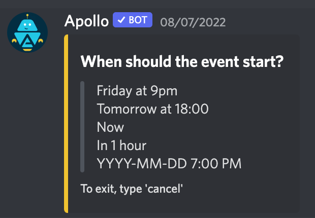<figcaption></figcaption></figure>

<figure>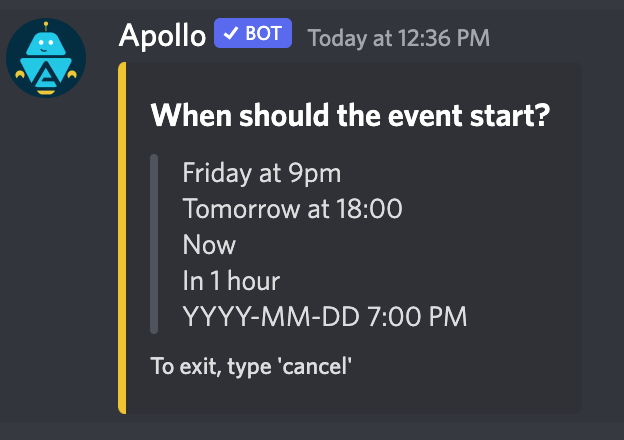<figcaption></figcaption></figure>

<figure>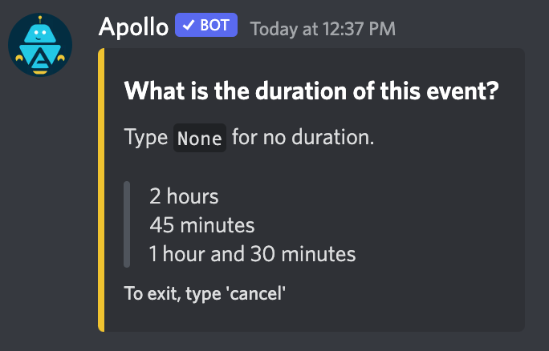<figcaption></figcaption></figure>

<figure>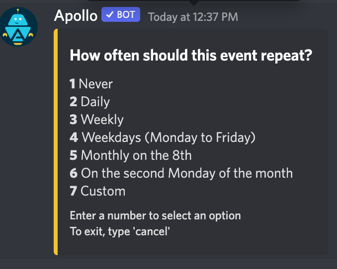<figcaption></figcaption></figure>

<figure><figcaption></figcaption></figure>

**Premium options:**

<figure>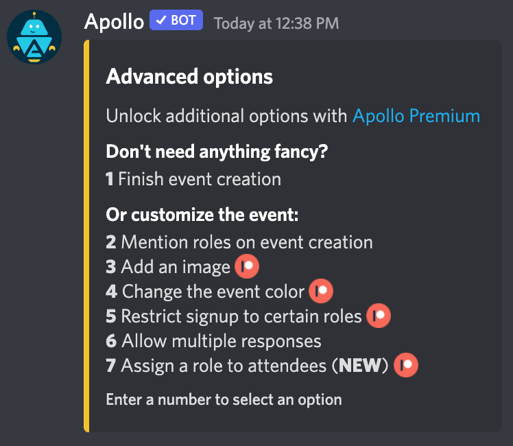<figcaption></figcaption></figure>

**Step 8:**

After finishing answering the bot questions, you should be able to see the event in the channel you specified.

Members of the discord can choose the Going, Not going, or Tentative (question mark option) on the post.

<figure>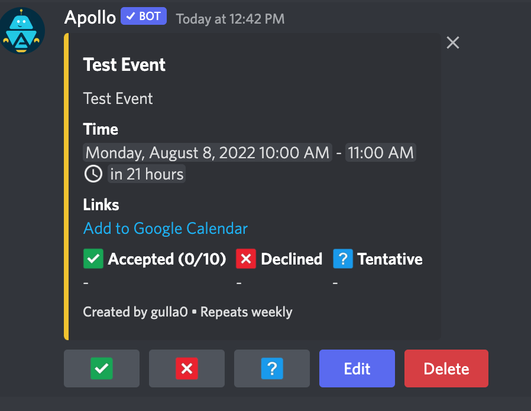<figcaption></figcaption></figure>

The discord manager can delete/edit the event if they choose to.

**Note:**

If the event is happening on a voice channel, you can post the link to the channel in the description for the event.

<figure>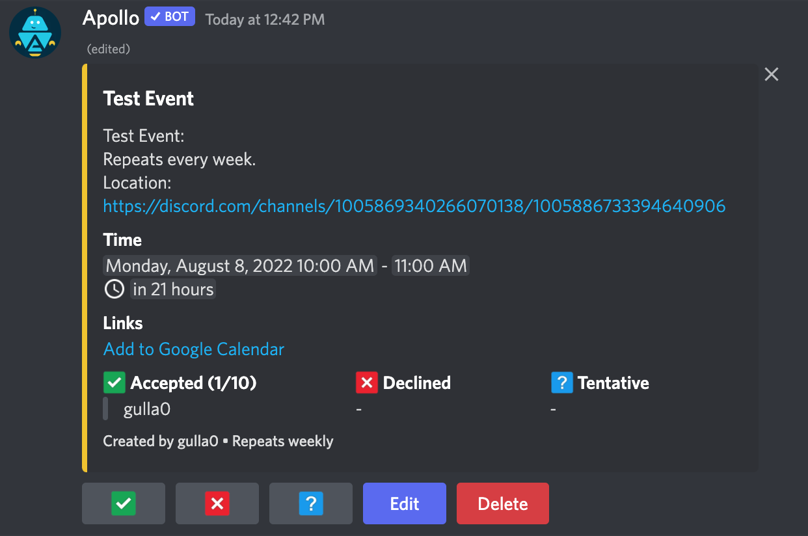<figcaption></figcaption></figure>

_**There is another bot called Sesh Bot but they only give recurring event options for premium customers.**_

### Why is this useful? 

1. Apollo Bot is essential in the discord channel because it enables community members to easily sign up for events with a single click of a button, right within Discord.
2. The Apollo Bot allows users to setup greeting messages that welcomes a user that joins your server for the first time. The customizable greeting system is embedded with multiple features to help the user make a greeting message of their own choice. Plus, the bot also provides some variables that enables its users to customize their greeting messages even more.
3. Apollo bot has a message counter system that will enable DAOs to keep track of message counts for each member in their discord server. The message counter system will enable DAOs to track the activities of their members in their discord and also enabling them to action when they suspect any message that doesn’t comply with the community guideline.

### Why is this tool important for DAOs 

1. The Apollo discord bot has a sophisticated has a very sophisticated and advanced giveaway system that DAOs can use to host a massive giveaway or token airdrops to incentivize the community. The most interesting fact about this bot is that the commands can display the amount of wins, hosted on a particular server, in addition to the count, this command also shows what prize has been won by that particular user in the community.

The bot also enables DAOs to set a “claim time.” That is, DAOs can set a specific time for the giveaway winner have to claim the "set prize.”

2. Apollo bot is very important for DAOs because it enables them to easily translate messages to over 100 languages with just a single click. Many DAO contributors hail from different part of the world where different languages a being spoken, Apollo bot will allow these DAOs and their members to understand each other.
