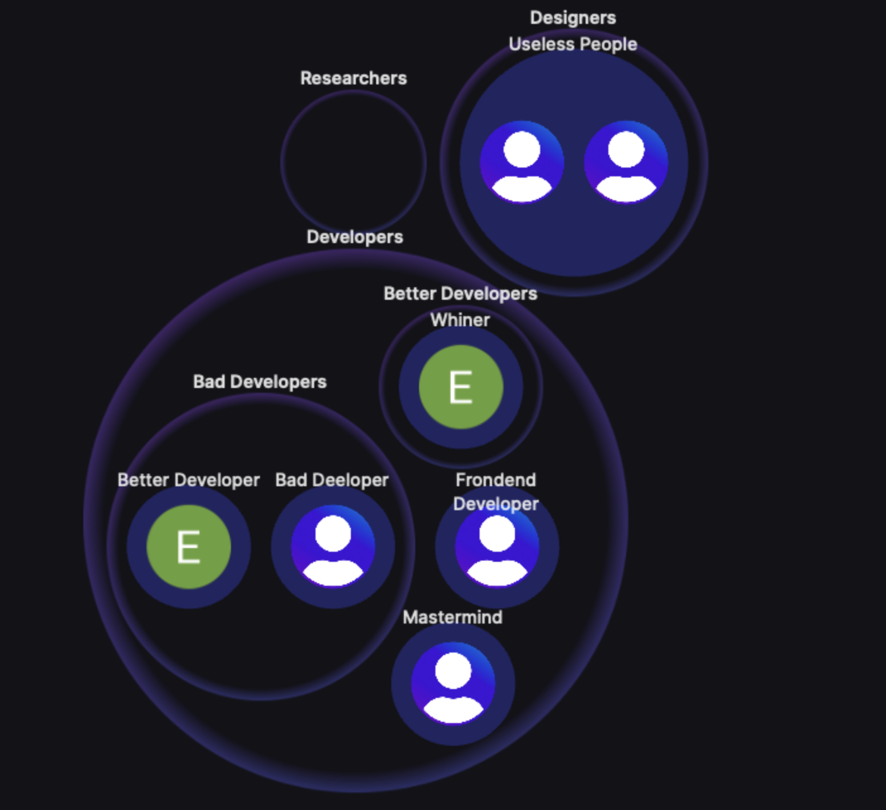
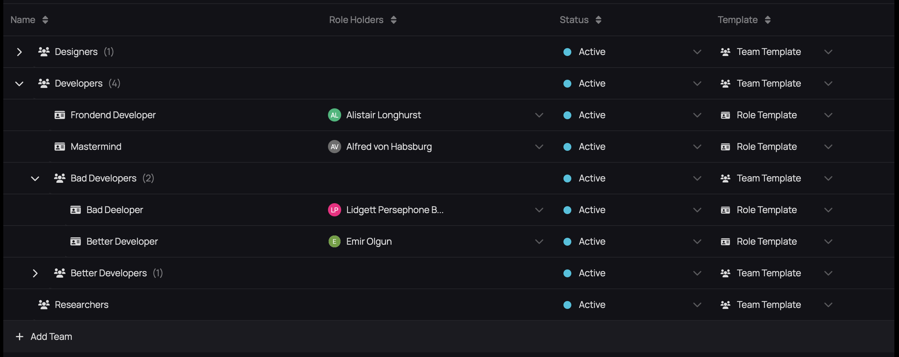
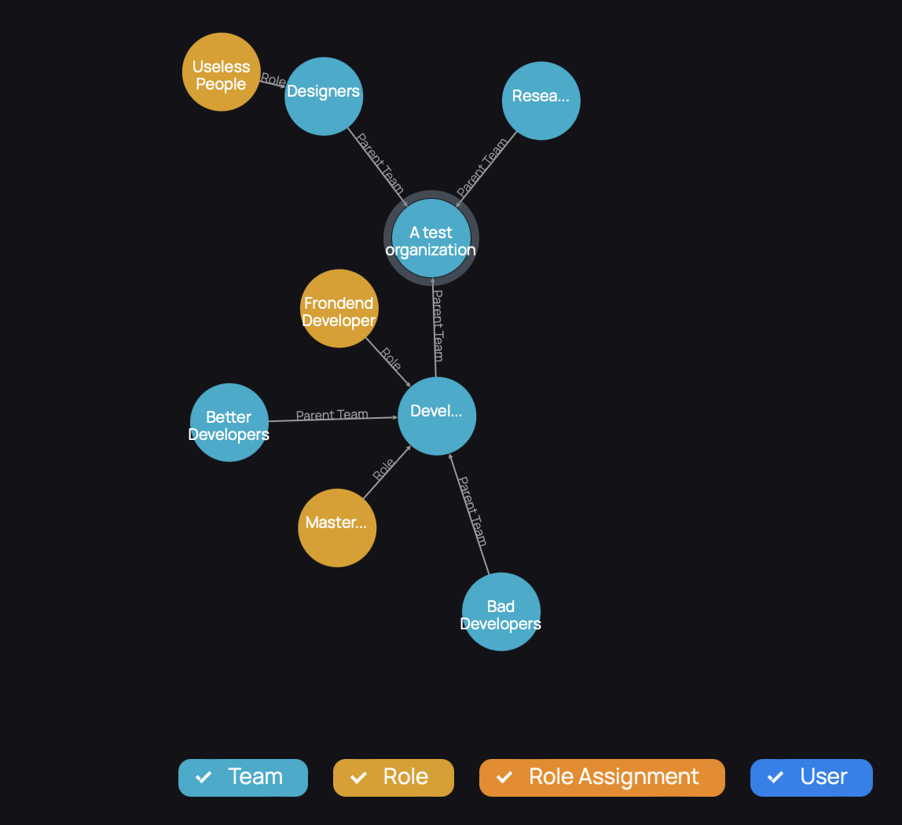
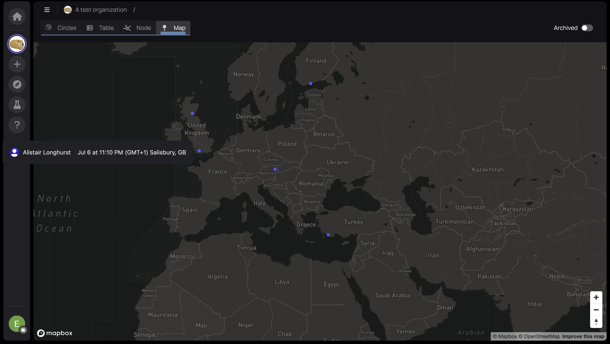

# Sobol

**Author:** _Emir Olgun_

**Date:** _7 July 2023_

Establishing remote working groups like DAOs is a fairly new concept. Remote working groups need structuring like any other organization. DAOs usually use Discord to organize their community into a structure of their choice. Discord is a great tool to manage an online community but it can easily turn into an overwhelming mess. When a DAO has a lot of members and a variety of work groups, it gets hard for members to track who is doing what. Another problem is, when a new member joins a DAO, it is usually a very poor experience for them. The Discord looks intimidating and complicated, they struggle to find the right place for them in the DAO. Sobol is a tool that helps DAOs organize their sub-groups and have good and scalable visualization about the structure of the DAO and its sub-groups to address the problems mentioned above.

### Features of Sobol

#### Visualizations

Sobol is a great tool to view the structure of organizations. There are four different ways to visualize the DAOs structure which are:

**Circles**

Circles visualize the groups and sub-groups that can be easily understood. Circles can be zoomed in and out so even if the organization has lots of groups and members, they do not become overwhelming.&#x20;

<figure><figcaption></figcaption></figure>

**Table**

The Table offers a clear view of the groups and people in them.&#x20;

<figure><figcaption></figcaption></figure>

**Node**

This view is similar to the circles. The advantage of this view is, you can filter teams, roles, role assignments, and users so you can have more clear charts to find what you need.&#x20;

<figure><figcaption></figcaption></figure>

**Map**

This view allows you to see where the members of DAO are in the world. When you hover your mouse over a member, you can see the current time of that location. This can be very useful to avoid messaging people at an inconvenient time.&#x20;

<figure><figcaption></figcaption></figure>

#### Integrations

**Discord**

Sobol has a Discord bot called Sobol Bot. This bot makes it possible to:

* Sync users between Discord and Sobol.
* Map Discord roles to specific teams in Sobol.
* Set update reminders to ping specific team stakeholders in Discord.

**Treasury**

Sobol has a Gnosis Safe feature which is in Beta currently. Sobol displays the balance of coins and assets inside the DAOs treasury and the transactions that took place by the treasury.

**What is a Gnosis Safe?**

Gnosis Safe is a smart contract wallet on Ethereum. It is a multi-signature wallet that requires multiple people to approve a transaction to occur.

**Snapshot**

Sobol plans to integrate Snapshot into the Sobol platform in the future. Snapshot allows DAOs to conduct off-chain governance by proposals and voting processes.

### Why DAOs Should Use Sobol

Sobol stands out as a pivotal tool for DAOs because it addresses some of the most pressing challenges these entities face in terms of organization and member engagement. As DAOs expand, the intricacies of their structure can become overwhelming, especially on platforms like Discord. Sobol offers a streamlined solution, providing clear visualizations of the DAO's structure, from overarching groups to individual members. Its diverse visualization modes, such as Circles, Table, Node, and Map, cater to different organizational needs, ensuring that members can quickly grasp the DAO's layout and their place within it. Furthermore, Sobol's integrative capabilities, including its Discord bot and Gnosis Safe feature, enhance synchronization, role mapping, and financial transparency. By offering a centralized platform that combines visualization with functional integrations, Sobol significantly simplifies the organizational challenges of DAOs, making it easier for members to collaborate, communicate, and contribute effectively.

### Conclusion

Sobol is a free-to-use tool currently. It is a very useful tool to organize and visualize the organization of remote working groups. Using this tool can profoundly reduce the workload of managing the organizational structures when expanding the organization.
