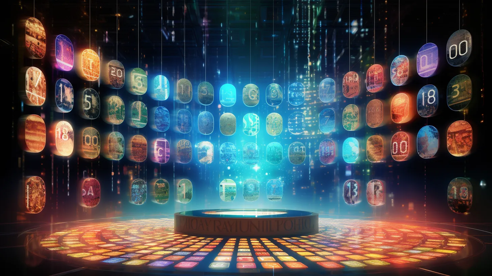

# Changing Paradigm of NFTs: LFF Action NFT

<figure><figcaption></figcaption></figure>

## I. Introduction

NFT's are a sophisticated and compelling concept that can be seen as a certificate of ownership of digital or physical assets on a secure, blockchain-based marketplace. Essentially, blockchain technology is a decentralized database that tracks transactions, and NFT's are cryptographic assets that employ unique codes and metadata to distinguish one from the other. Since they are non-interchangeable, they cannot be replaced by identical copies, and this makes them a powerful tool for establishing ownership of digital creations. These unique digital tokens can be traded on digital platforms, enabling artists worldwide to sell their creations while retaining control over their copyrights.

In this paper, we will first examine what NFTs are and then focus on their real-world applications. We will establish the legal status of NFTs, if necessary. After establishing the legal status of NFTs, we will continue our research by examining the importance of metadata for NFTs. After outlining the basics of NFTs and their implications, we will cross-examine LFF’s Action NFTs with other NFTs. Eventually, we will investigate whether NFTs can be used as a digital notary in this paper.

\
\
\
\

## II. Overview of Non-Fungible Tokens (NFTs)

NFTs are a relatively new addition to the crypto asset ecosystem. However, they seem to be attracting even more attention than their predecessors. Like many other types of crypto assets, NFTs generally lack a legal definition. This causes some hesitation within the ecosystem. Although there is no uniform legal definition of NFTs, here are some prominent features that may be used to tell what NFTs really stand for.&#x20;

### A. The Definition and Characteristics of NFTs

Non-Fungible Tokens (NFTs) are unique, indivisible, and non-interchangeable digital assets that exist on a blockchain. They may be used as useful tools to represent ownership of a particular digital or physical asset, such as artwork, music, videos, collectibles, virtual goods, or real estate. The main characteristics of NFTs include their uniqueness, provable scarcity, and ability to be transferred and traded on various platforms.

NFTs, as the name suggests, differ significantly from classic tokens due to their lack of fungibility. But what exactly does “fungibility” mean? Fungibility refers to the characteristic of an asset or good that allows it to be exchanged for another unit of the same asset or good without any loss in value. Fungible assets or goods are essentially indistinguishable from each other. For instance, fiat currencies are generally considered fungible - a single U.S. dollar bill can be swapped with any other U.S. dollar bill without resulting in a loss of value.

Bitcoin is another example from the world of crypto assets and is generally considered fungible - one Bitcoin has a similar value and utility as any other Bitcoin and can be exchanged without any loss of value.

The primary difference between NFTs and these other assets is that NFTs are each unique and non-interchangeable. Since each NFT represents a distinct and different asset with its own inherent value or utility, they cannot be exchanged for one another at all or at least without some form of change in value.

### B. Underlying Technology of NFTs: BlockChain

Like other crypto assets, NFTs are considered secure, transparent, and immutable. To ensure these features, NFTs are built on decentralized blockchains that record transactions across multiple databases such as computers. This makes it almost impossible to alter or tamper with the data. Most popular NFTs are built on Ethereum blockchain which utilizes ERC-721 or ERC-1155 tokenization standards. However, Ethereum isn’t the only blockchain that enables the minting of NFTs, other blockchains such Binance Smart Chain and Cardano also support the minting of NFTs.&#x20;

As NFTs are promoted based on their authenticity and originality, the use of blockchain technology is essential. The prominent features of blockchain ensure that NFTs have a verifiable origin, which allows ecosystem members to trace the ownership history of a digital asset and examine its originality.

### C. Real World Applications of NFTs

Although there is no uniform approach to defining NFTs, they are increasingly being used in various industries and platforms. Below are some real-world examples of how NFTs are being applied:

#### i. Art NFTs

With digitalization of every aspect of our daily lives, it seemed like NFTs were the last piece of puzzle needed to complete the transformation of art. Since NFTs paved a new way for artists and collectors to buy, sell and trade their art, Art NFTs have drawn enormous amounts of attention. Art NFTs aim to offer a solution to monetizing problems that artists face in the digital era.&#x20;

Artists now may tokenize their either physical or digital work. Tokenization of a work plays an important role in determining the uniqueness of a work. They primarily provide the ensurement of authenticity. Artists sometimes have a hard time getting the royalties they are actually entitled to. It is possible to set up a royalty system integrated into the NFT that enables the artists to earn a royalty due to the transactions of their work in the secondary market.&#x20;

While it is impossible to list every application of Art NFTs; CryptoPunks, BoredApe NFT, Beeble may be shown as popular examples.&#x20;

#### ii. Collectible NFTs

NFTs can be used to represent digital collectibles such as trading cards, virtual pets, and limited-edition items. These one-of-a-kind digital artifacts range in rarity and worth. CryptoKitties, NBA Top Shot, and CryptoPunks are some prominent examples. These collectibles are frequently exchanged on specialized marketplaces and have the potential to increase in value over time.

#### iii. Gaming NFTs

NFTs in gaming enable the ownership and trading of in-game assets such as skins, weapons, and characters. This gives users full ownership of their digital things, allowing them to trade or sell them in secondary markets. Axie Infinity, The Sandbox, and Decentraland are three prominent blockchain-based games that use NFTs.

#### iv. Utility NFTs

Utility NFTs main feature is that they provide their holders with some rights; such as accessing certain products and services. Contrary to Collectible NFTs and Art NFTs, Utility NFTs aim to offer their holders some practical use. The certain practical use depends on the utility that the NFT has to offer. For example, some Utility NFTs enable their holder to have access to some exclusive content. Some Utility NFTs may be considered as symbol membership to certain clubs or platforms. Additionally, in DAOs, it is possible to benefit Utility NFTs to grant governance and voting rights to specific members of a DAO. Furthermore, there have been cases where these Utility NFTs are being used as authentic tickets to certain organizations or events.&#x20;

\
\

#### v. Payment NFTs

In comparison with other types of NFTs, Payment NFTs are a relatively new concept. NFTs’ nonfungible feature may seem challenging for it to be used as a means of exchange. However, the nonfungible feature of NFTs may be useful in providing customized digital currencies which can be essentially used in loyalty or reward programs.&#x20;

These Payment NFTs may be used by companies or foundations to incentivize the members of their ecosystems. Companies and foundations may use Payment NFTs to build and strengthen loyalty and engagement.&#x20;

## III. Legal Status of NFTs

It is common to see the law struggle to keep up with the ever-evolving technology. Lawmakers must first understand new technologies and their products in order to properly regulate them. If humans cannot comprehend something, they cannot regulate it effectively. Additionally, poorly calculated regulations have the potential to hinder the development and usage of a technology. Relevant regulations for crypto-assets and blockchain technology are still forthcoming.

### A. Current Legal Landscape

As NFTs are still a relatively new concept and product, it is safe to say that legal frameworks regarding them have not yet been fully developed. Although there is serious legislation in progress concerning crypto-assets and blockchain technology in different jurisdictions, currently no legislation exists or in the preparation process that exclusively targets NFTs. However, this does not mean that there is no applicable legislation to NFTs. Before delving into any legal examination of specific issues related to NFTs, it is important to emphasize that relevant laws and regulations may be applicable to NFTs, even if they do not explicitly mention them. Intellectual property law, consumer law, contract law, tax law, securities law, and CFT and AML regulation may be found applicable to NFTs and transactions involving them. In conclusion, it is crucial to thoroughly examine each NFTs in this regard.&#x20;

### &#x20;B. Intellectual Property and Copyright Aspect of NFTs

The application of civil law ownership rules to NFTs remains unresolved. As per the legal systems with Roman law tradition, ownership is defined as possession of a physical object that can be perceived and located. However, this definition is not applicable to digital tokens like NFTs. Consequently, there is no uniformity in the definition of NFT ownership across various national regimes due to the absence of harmonized property laws in the EU.

NFTs are not to be considered as artworks, as they serve the purpose of recording the creation and ownership of an asset that may, in fact, be an artwork. Rather, NFTs are a tool of cryptography, governed by a smart contract- a concise software program that controls the operation of the NFT. Utilizing blockchain technology, this contract verifies the documents the existence and ownership of both digital and three-dimensional assets.

As an NFT buyer, you gain full control over the smart contract that governs the functions of the NFT. This contract registers your ownership on the blockchain, providing indisputable evidence of your possession of the asset associated with the NFT, whether it’s a stunning artwork or a valuable piece of property. It is important to note that while owning an NFT doesn’t grant you copyright or control over the artwork automatically, it’s still a powerful investment in today’s NFT industry and crypto community.

There exists a notable distinction between the act of purchasing a tangible piece of artwork and acquiring a digital artwork tokenized for ownership.

Copyright safeguards "the work," but it is not synonymous with the creation or expression conceived by the author. This distinction is vital in understanding why NFTs do not inherently confer copyright. It is worth noting that the copyright is an autonomous property distinct from the work it protects.

**i. Copyright ownership of NFTs**

It is widely accepted by the United States and the world at large that, from a legal standpoint, copyright is a distinct form of property from the object or file which contains the protected work. This is because a copyright entails several individual rights that can be exercised or even sold separately. It is crucial to note that the object containing the work can be sold independently from all the copyright rights.

Not only is it a well-established principle that the physical or digital copy of a work can be sold separately from the copyright, but current copyright law also presumes that the buyer of such copy does not acquire the copyright unless it is deliberately licensed or transferred. This serves to protect the rights of copyright holders and ensures that their creative works are properly safeguarded.

When purchasing digital art, it is important to note that unless the copyright is transferred to the buyer, they cannot make copies or derivative works of the original. Additionally, they cannot prevent others from making copies, whether authorized or not. However, owning an NFT linked to the artwork still designates the buyer as the registered owner of the original copy. Obtaining the copyright to the artwork can provide the buyer with several attractive rights, such as the right to copy, sell, and distribute the work. This is especially important if the art is to be used in future projects or activities that require copies to be made. By owning the copyright, the buyer can have a say in preventing unauthorized copying of both digital and physical art.

A complete transfer of copyright ownership to the buyer is referred to as an assignment, and it must be executed in writing rather than verbally or through actions. On the other hand, when only a portion of the copyright is transferred, it is commonly known as a licensing agreement.

**ii. Licensing agreements for NFTs**

There are two primary types of licenses: exclusive and nonexclusive. An exclusive license grants the licensee sole access and use of the licensed rights, without the possibility of the copyright owner granting the same rights to another party. To transfer exclusive rights of any economic value, a written agreement is essential. Conversely, a nonexclusive license allows the licensee to use the rights, but the copyright owner has the liberty to grant the same rights to multiple parties. The transfer of nonexclusive rights can be carried out orally or through the parties' conduct, without the need for a written agreement.

There exist diverse methods to effectively communicate license terms for a portion of the copyright intellectual property of an artwork. We have listed them in order of their probable recognition as a legally valid license:

* A mutually negotiated agreement between the seller and purchaser prior to purchase

The option of a mutual agreement presents an exquisite solution as it enables the seller and buyer to engage in fruitful communication, reach a consensus and mutually agree on the terms of the sale. They can then formalize their agreement by signing a written document, which can be conveniently done electronically, specifying the rights conveyed. Essentially, this creates a contractual agreement that grants the purchaser the license or even the complete copyright to the artwork.

* License terms embedded within the smart contract of the NFT

Incorporating the terms of a license into the smart contract of the NFT that is being sold is a highly effective way to ensure legal compliance. The written terms in the code and the ability to access and control the smart contract are integral parts of the NFT purchase. Smart contracts commonly contain license terms within their code, making this option a practical solution. By including the license terms or a link to them in the metadata of the smart contract, each owner of the NFT will have notice of those terms as they will be transferred with the smart contract.

* Pop-up clickwrap license terms presented at the point of purchase

&#x20;This option offers the benefit of requiring a clear and affirmative action of acceptance, such as clicking a button to agree to the terms of use at the point of purchase. This type of "clickwrap" license is generally favored by the law over "browse wrap" licenses, which rely on implied consent. While implied consent is not insignificant, the act of clicking to agree is a stronger indication of assent, similar to signing a contract. However, it's important to note that both types of licenses are only effective for the initial buyer of the NFT.

* License terms outlined in the NFT sales platform's listing and item description

If you are a creator, when selling an NFT on a sales platform, you hold the power to craft a captivating and informative description of your masterpiece within the listing. You can even include the license terms or a link to the license, thereby ensuring that the purchaser has access to all pertinent information prior to making their purchase. This exemplifies a level of transparency that reinforces the purchaser's understanding of the terms and conditions associated with their acquisition.

* License terms displayed on the website of the NFT creator

One of the most popular ways to disclose licenselicence terms is through the creator's website. It is a convenient and effortless option, especially for creators who may want to adjust the terms as their project progresses. However, it lacks an actual or implied agreement from the buyer of the NFT, which may not be ideal for those looking for easy enforcement of the terms. Nonetheless, it is still better than having no terms disclosed at all.

When crafting a license agreement, there are numerous possibilities to explore. However, it is crucial to take into account the following rights while designing the terms of the license:

1. the right to display
2. the right to copy for specific incidental purposes
3. the right to create derivative works, the right to commercially exploit the artwork&#x20;
4. the option to share everything through the use of Creative Commons licenses&#x20;
5. the possibility of selling everything by assigning the copyright to the purchaser.&#x20;

By thoughtfully considering these rights, the drafter can create an elegant and persuasive license agreement that meets the needs of all parties involved.

**iii. Resale Royalties**

NFTs represent a groundbreaking technological advancement, particularly in the realm of art, as they provide a means for artists to receive resale royalties. By incorporating a royalty payment system directly into the NFT's underlying "smart contract," artists can rest assured that they will receive a ten-to-twenty percent cut of any future resales. This automated process eliminates the need for purchasers to comply with individual royalty agreements and ensures that payments are promptly delivered to the artist's digital wallet. Overall, NFTs offer an elegant and persuasive solution for promoting fair compensation within the art industry.

In addition, artists have the right to receive a royalty based on the total amount received from the resale of their NFTs, which is commonly referred to as "Droit De Suite". With the integration of smart contracts, the management of this right no longer requires the involvement of collecting societies, providing artists with greater control and balance of power. It is worth noting that the miner of the NFT receives the resale price, but if the author is the initial owner of the NFT, they can benefit from the resale royalty.

### C. Jurisdictional Differences&#x20;

As it is repeatedly stated through this paper, there is no uniform approach regarding NFTs. As a matter of fact, crypto assets generally lack legislation. Therefore, legal qualifications of NFTs and crypto assets in general, may differ substantially. Each country has a unique approach to NFTs and crypto assets. The variation on approaches closely affects the rights and obligations of NFT creators, purchasers, and sellers. &#x20;

Even though it is not possible to clearly define the legal qualification of NFTs in each jurisdiction, some of them are as follows.

#### i. USA&#x20;

In the United States, there are no specific laws regulating NFTs. However, this doesn’t mean that there is no applicable law to cases regarding NFTs. Existing laws such as intellectual property, contract, tax and securities law may be applicable to NFTs depending on the specific case. If a NFT is eligible to be considered as a work, then, intellectual property law regulations may be applicable. On the other hand, digital assets such as NFTs and other crypto assets may be accepted as property by the Internal Revenue Service. As a result, NFTs may be subjected to taxation such as capital gains tax.&#x20;

When determining whether something is a security or not, the criteria stipulated in the Howey Test are used. It is unlikely but if a NFT is deemed a security, then, securities law may be applicable.&#x20;

Furthermore, similar to other crypto assets and ecosystems, Financial Crimes Enforcement Network may require NFT marketplaces to comply with the relevant Anti-Money Laundering (AML) and Know Your Customer (KYC) regulations.&#x20;

#### ii. European Union&#x20;

The main legislation in the European Union is the Markets in Crypto Assets (MiCA) Regulation. Even though MiCA offers a great clarity and foreseeability to crypto asset ecosystems, this regulation clearly states that it excludes crypto assets that are unique and non-fungible with other crypto assets. As a result, it is safe to say that as a rule, MiCA will not be applicable to NFTs.&#x20;

The fact that MiCA is not applicable to NFTs in principle does not mean that there is no applicable law to NFTs in the EU. There are important regulations such as GDPR and 5th and 6th AML Directives that have to be followed. If a NFT involves personal data, then, GDPR can be applicable. Moreover, if necessary, KYC and AML regulations can extend to the NFTs.&#x20;

In terms of intellectual property law, the EU, in general, recognizes copyright of digital assets. NFTs that have a copyrightable matter, may be subject to intellectual property laws of relevant jurisdiction, which in fact vary.&#x20;

#### iii. Türkiye

It has been known for a long time that Türkiye has been working on introducing a new legislation regarding crypto assets. However, as of May 2023, there is still no specific legislation that exclusively targets NFTs or other crypto assets. Nevertheless, general rules and principles of law and relevant legislations are applicable to NFTs.&#x20;

Just as classic works, digital versions of works are copyrightable in Türkiye. If a NFT involves a copyrightable work, then, Turkish intellectual property law rules will be applied.&#x20;

Since there is no clear legal qualification on crypto assets, taxation aspects of crypto assets and NFTs are debatable. Taxation of NFTs varies depending on the nature of the transaction conducted with them. If the event resulting from the NFT is eligible to be considered as a taxable event, then, NFTs may be subjected to income tax, capital gains tax, etc.&#x20;

Furthermore, NFTs may be subject to securities law depending on their nature. If a NFT is eligible to be deemed as a financial instrument or even a security, then, relevant securities law may be applicable. The approaches of Capital Markets Boards and Banking Regulation and Supervision Agency on crypto assets and more specifically on NFTs are crucial in determining the applicable laws to NFTs.&#x20;

Additionally, if the criteria on accepting a transaction as a consumer transaction is met, then, NFTs may be also subject to consumer protection law.&#x20;

\
\
\
\

## V. Metadata and its Role in NFT Transactions&#x20;

Metadata is commonly defined as data that offers insights into other data. Its primary purpose is to differentiate between the actual data, such as an object or dataset, and the accompanying information that describes and defines it, known as metadata. This information can come in various forms, including descriptive, structural, and administrative metadata, all of which can facilitate numerous tasks, from identifying and discovering resources to organizing collections. Overall, metadata plays a crucial role in supporting various information-related activities.

NFT content can include physical or digital items such as tweets, music videos, images, documents, artworks, and even immovable property. These items can be tokenized as NFT, and the multimedia file within can have various extensions like .png, .jpg, .mp3, .pdf, .mp4.

NFTs can represent existing assets or digital artworks, allowing for legal transactions on the blockchain. The metadata in NFTs is crucial and defines and describes the NFT, and JSON is the most commonly used format for this metadata. Essentially, when an NFT is acquired, it is the metadata that is being acquired.

NFT metadata should include the name, description, and content of the NFT. Storing the entire multimedia file on the blockchain makes NFTs more valuable and secure, but it is expensive. Many NFTs have a link to access the multimedia instead. The location of the multimedia is important, and using IPFS is more secure as it offers permanent storage.

IPFS assigns a unique Hash to each file and distributes them across multiple nodes instead of on a single server. This system is similar to blockchain and the two technologies can work together. However, storing large amounts of data on a blockchain can be expensive so only the IPFS Hash for the file is stored in the blockchain. This allows for the combination of these decentralized systems.

The common method of utilizing IPFS in NFT applications involves saving NFT metadata in IPFS. This can be easily done using applications like "Pinata" to upload and manage files. The resulting hash of the file saved in IPFS is included in the NFT contract along with a URL address associated with the corresponding token ID. This IPFS-based URL address points directly to the data, making it more secure and permanent compared to traditional centralized website extensions. Therefore, storing NFT content in IPFS may be a good idea if it needs to be stored outside the blockchain.

The intricacies of metadata within the realm of NFTs can be quite intricate and encompass a variety of legal domains such as intellectual property, contract, and data protection laws. It is imperative to take note of the following legal factors when dealing with metadata.

### A. IP Rights, Licensing and Authenticity&#x20;

The preservation of intellectual property rights is of the utmost importance in the digital age. Metadata serves as a valuable tool in identifying the creator of a digital asset and any pertinent copyright or trademark information. It is imperative that the metadata accurately reflects these rights in order to prevent any potential conflicts or infringement matters from arising.

Metadata holds valuable information on licensing and usage rights granted to NFT purchasers. Such information dictates the permissible ways of using, displaying, and reselling the digital asset. Comprehending the licensing terms and conditions outlined in the metadata is crucial for both parties to adhere to legal requirements and prevent any conflicts.

The use of metadata can elegantly establish the provenance and authenticity of a digital asset, which is crucial from a legal standpoint. This is particularly relevant in scenarios where disputes arise regarding the original creator or chain of ownership of a digital art piece. Consequently, safeguarding the precision and reliability of metadata is paramount in upholding transparency and trust within the NFT market.

\

### B. Agreements and Validity&#x20;

Metadata within NFT transactions may include contractual agreements or terms between parties. This can be exemplified by the specification of agreed-upon terms and conditions upon the purchase of an NFT. The enforceability of these agreements is subject to a variety of factors, such as jurisdiction, the clarity of the terms, and the mutual understanding and consent of the parties involved.&#x20;

In Turkish law and with slight differences in many jurisdictions that follow Roman Law, agreements are formed via offer, acceptance, consideration, and intention of the parties. Parties who have the legal capacity to do so can enter into agreements when their declaration of intent is met. Unless it is explicitly stated by law that an agreement on a specific subject has to be in formal written form, agreements may be formed verbally. Additionally, it is not mandatory to form an agreement on a piece of paper. Agreements can also be formed online, even on blockchain.&#x20;

Assuming that a NFT has an agreement embedded on its metadata, is this agreement valid? Explanations provided in previous paragraphs are valid in terms of NFTs. If the intention of the parties is duly met and their intention to enter into such agreement is clear, and if the said agreement is valid in terms of other criteria, then, the agreement embedded in metadata of the NFT is deemed to be valid.&#x20;

### C. Data Privacy

The inclusion of personal information within metadata pertaining to NFTs necessitates adherence to data protection and privacy laws, such as the GDPR in the European Union. Those handling such data must ensure compliance with applicable regulations, including obtaining consent, providing notice, and implementing proper security measures.

Furthermore, data protection regulations generally require data controllers to obtain explicit consent from persons prior to collecting persons’ personal data. Since metadata of an NFT may contain some personal data, the relevant consents shall be obtained. In this regard, individuals who are subject to data processing, shall be informed about the collection and processing of their data as well as the purpose of data processing.&#x20;

Moreover, data controllers have the tendency to collect as much information as possible. Data protection regulations such as EU’s GDPR and Türkiye’s KVKK aim to minimize the amount of collected personal data. Data controller shall collect only the data that are necessary to achieve the purpose of their collection. As a result, when forming the metadata, one shall act on utmost care about the personal data involving metadata.

Additionally, obligations of data controllers extend to protection of personal data. Data controllers have to provide the necessary protection to personal data they process. Security measures to be taken in this regard shall provide appropriate security from unauthorized access, disclosure or alteration. Since metadata and NFTs are built on blockchain, these innovative technologies can be used as a tool for protection of personal data.&#x20;

In conclusion, the content of the metadata of a NFT has significant effects and consequences in terms of data protection regulations. General rules and principles stipulated in relevant data protection regulations are applicable to the metadata of NFTs.&#x20;

### D. Liability&#x20;

The accuracy of metadata is of utmost importance as any inaccuracy or false information can result in legal disputes and potential liability for all parties involved. For instance, relying on incorrect metadata about the creator or licensing rights can cause NFT buyers to face legal issues related to copyright infringement and suffer damages. The individuals responsible for providing or maintaining the metadata may be held accountable for such consequences. Therefore, it is crucial to ensure the accuracy and authenticity of metadata to avoid any legal implications.

To summarize, metadata is a crucial component of NFT transactions, and its legal implications span across multiple areas of law, including intellectual property, contract, and data protection laws. It is imperative for both NFT creators and buyers to understand the legal ramifications related to metadata and implement necessary measures to guarantee its precision, reliability, and adherence to relevant laws and regulations.

&#x20;VI. NFTs as Digital Notary

The role of a notary is much more than simply validating a signature and confirming transactions. It encompasses a vast array of responsibilities, including assessing the signer's capacity and ensuring the legality of the transaction. The notary assumes full responsibility for drafting the document, guaranteeing its legality, and confirming that all parties involved comprehended its contents. Moreover, the notary also provides impartial advice, takes measures to prevent money laundering, and notifies the relevant public administration bodies of the transaction. In short, the notary is an indispensable resource for those seeking legal and ethical guidance in their dealings.

Blockchain technology has the ability to provide permanent document storage and enables the automation of agreements, which minimizes the need for intermediaries and simplifies procedures. The documents can be signed by all parties involved and are recognized as official. In this way, blockchain technology serves much similarly to notaries.&#x20;

While it is true that blockchain technology can verify the authenticity and ownership of goods on a public network, it is incapable of performing the full range of functions that notaries offer in legal terms. Unlike notaries, for now, blockchain cannot draft legal documents, verify the grantor's capacity or comprehension, or guarantee the legality of the transaction.&#x20;

Furthermore, the notaries are worldwide acknowledged entities, meaning that even if the blockchain technology is suitable for becoming a digital notary, it must be recognized legally in order to perform as such. This is a topic in discussion internally, but no actions nor regulations have been taken or proposed in any part of the world for now regarding acceptance and recognizing the blockchain technology as a digital notary.&#x20;

VII. LFF Action NFTs&#x20;

lLittlefish Foundation’s Action NFTs offer a new method of doing business. lLittlefish Foundation provides the necessary ecosystem for people to gather around a purpose and the Colony. As Colonies work to achieve their goals, they produce valuable content and conduct activities. Colonies are expected to tokenize their activities and mint NFTs regarding their activities and content. NFTs minted in this process are called Action NFTs. Thanks to these Action NFTs, activities and content of the Colonies are properly recorded indefinitely in the blockchain.&#x20;

Next step is about creating and distributing the value. To incentivize the valuable contributions of the Colonies, lLittlefish Foundation sells the Action NFTs. These Action NFTs can be bought by the members of the lLittlefish Foundation or by third parties. The value created in this process is distributed amongst lLittlefish Foundation and the relevant Colony, in accordance with the agreements between each.&#x20;

Depending on their metadata, these Action NFTs may be considered as Art NFTs, Collectibles or Payment NFTs. Regardless of how they are artificially considered, relevant data protection, intellectual property, agreement, and tax laws may be applicable.&#x20;

Most of the evaluations given on the Section IV. Metadata and its Role in NFT are still valid for Action NFTs. Here is how:

First of all, since Colonies transform their content and actions into Action NFTs, these Action NFTs may contain copyrightable works. As stated before, purchasing just the NFT does not mean that the purchaser also gained the intellectual property rights relating to the underlying work of NFT. Unless otherwise is explicitly stated, intellectual property rights of the work remain with the seller. In conclusion, it is strongly recommended for both seller and buyer to regulate the intellectual property rights relating to underlying work of the Action NFT.&#x20;

Secondly, it is important to take into account the tax consequences of selling and purchasing an Action NFT. Depending on the nature and parties of the transaction, the seller may be subject to income tax, and capital gains tax. In terms of Turkish Law, if the seller is a business, then, the income generated from such sale may be considered as business income which is taxable. On the other hand, if the seller is an individual, then, the income generated may be regarded as self-employment income. The situation of the buyer is somewhat different. If the buyer resells the said Action NFT at a higher price than the price they paid, then, the realizedrealised profit from such transaction is taxable as capital gains tax.&#x20;

With regards to the USA, the IRS recognizes NFTs as property alongside with other crypto assets. Basically, if you sell the Action NFT at a higher price than the price you bought, then, the gain resulting from such a transaction is subject to capital gains tax. However, if you are the creator of the Action NFT, then, the gains arising from your first sale of the Action NFT are accepted as ordinary income and taxed accordingly.&#x20;

Thirdly, these Action NFT transactions may be executed through various sale methods such as direct sale or auction. The sale method of Action NFTs doesn’t really change much. The key components of selling and purchasing a NFT stipulated in this article are mostly applicable for different sale methods. It is strongly recommended that both buyers and sellers shall be well aware of the accurate information about the transaction they enter into such as intellectual property law.&#x20;

\
\
\
\
\
\
\
\

## LEGAL DISCLAIMER

THE INFORMATION PROVIDED IN THIS PAPER PROVIDES GENERAL INFORMATION AS TO THE POSSIBILITIES IN MULTIPLE JURISDICTIONS. PLEASE KEEP IN MIND THAT LAWS THAT APPLY TO THE SUBJECT HEREIN MAY DIFFER IN EACH JURISDICTION. THUS, NOTHING CONTAINED HEREIN CONSTITUTES ANY LEGAL OPINION OR SUGGESTION OF ANY KIND. PLEASE CONSULT TO LOCAL EXPERTS IN RELEVANT AREAS BEFORE TAKING ANY ACTION BASED ON ANY INFORMATION CONTAINED HEREIN.

\
\
