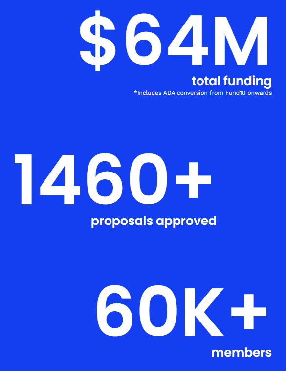

# The Tools of Project Catalyst

Project Catalyst is Cardano blockchain’s driving force. It is a community controlled decentralized fund that provides funding to projects that build on the Cardano blockchain.

As of October 2023, there have been 10 funding rounds, with more than 1460 proposals approved, with a total of $64M. The latest fund had a budget of 50M ADA, or around $12.5M. All this, and it only started back in 2020.

Funded proposals include a wide variety of projects: hardcore blockchain infrastructure, community spaces, decentralized applications, media channels to spread Cardano, DAO tools, and a whole lot more.

<figure><figcaption></figcaption></figure>

### Participating in Catalyst

The best part of Project Catalyst is that anybody can participate. If you have a great idea and you would like to get funding, you can propose on [Ideascale](https://cardano.ideascale.com/). Once the proposals are finalized, it is the turn of the [Community Reviewers](https://docs.projectcatalyst.io/catalyst-basics/how-to-participate-in-community-reviews). Then any ADA holder can [participate](https://iohk.zendesk.com/hc/en-us/articles/900005679386-Catalyst-registration-and-voting-guide) in the votes to make the decision for who gets funded. Once its all said and done, Challenge Teams guide the winning teams through the future steps as the teams get their funding and are expected to deliver on their promises.

That’s only the official process. There’s a whole lot more underneath it all in the multitudes of communities that have popped up around Project Catalyst.

### Why this report?

This report aims to give anybody a broad overview of what Project Catalyst is, provide the main resources to dive into it, and give an overview of the tools you can use to dive deep into the ecosystem.

In this report, you’ll find

* resources to learn about Project Catalyst
* tools to interact with Project Catalyst
* communication channels
* a deeper dive on Lidonation’s Catalyst explorer, the best tool to explore Catalyst

## The Tools to Use

Ok, so you’re interested in getting involved, looking to learn about Project Catalyst and the thousands of projects it is supporting. So what do you do? Where do you go?

### The Official Website

[https://projectcatalyst.io/](https://projectcatalyst.io/)

If you are new, this is the place to start. This flashy website will introduce what Project Catalyst is all about, what the process is, and how to get started.

An overview of what you can do here:

* learn the basics,
* find how to get involved as a proposer, a voter, or a reviewer,
* read blog posts by the Catalyst team,
* search and view through all the proposals starting from Fund 1.
* find the well hidden [knowledgebase](https://docs.projectcatalyst.io/about-project-catalyst/what-is-project-catalyst) that goes into more detail on everything.

### **Lidonation Catalyst Explorer:** The #1 tool for all things Project Catalyst

[https://www.lidonation.com/en/catalyst-explorer/proposals](https://www.lidonation.com/en/catalyst-explorer/proposals)

Catalyst Explorer is a comprehensive set of tools for navigating the thousands of proposals in Project Catalyst.

It has so many features, it’s difficult to cover but here’s a glance of what you can do:

* [Proposals](https://www.lidonation.com/en/catalyst-explorer/proposals): search through thousands of proposals, filter by fund, challenge, tags, groups people, project status
* [People](https://www.lidonation.com/en/catalyst-explorer/people): who is behind all the proposals, who’s getting funded, who is not, how much are they getting funded, you can find all that and more here.
* [Groups](https://www.lidonation.com/en/catalyst-explorer/groups): find who the big groups behind the proposals are, how much they have been funded, or not
* [Monthly Reports](https://www.lidonation.com/en/catalyst-explorer/reports): when proposals are funded, the teams report monthly with updates on how the projects are going. This tool allows you to search and find through the monthly reports, though the one
* [Funds](https://www.lidonation.com/en/catalyst-explorer/funds): Explore proposals fund by fund
* [Proposal Assesments](https://www.lidonation.com/en/catalyst-explorer/assessments): Once proposals are finalized, they get assessed by the community, find and read through any review here.
* [Charts](https://www.lidonation.com/en/catalyst-explorer/charts): How much impact do whales have on the vote? What about littlefish with small holdings? This and a lot more explained through charts.
* [Voter tool](https://www.lidonation.com/en/catalyst-explorer/voter-tool): When it’s time to vote, this is a good place to find good proposals to vote for.
* [API](https://www.lidonation.com/catalyst-explorer/api): And an API to build on top of. Get proposal, fund, group, people, tag data, as well as ledger snapshots of the votes.

#### Who should use this tool?

**Potential Proposers**

Project Catalyst is **very competitive.** If you want to get your project funded, you need to do the work. Jump into the Explorer and look for patterns on what gets funded. What type of proposals are looked down upon? Which challenges are more competitive?

**Looking to find a team, co-founder, a job**

Catalyst is the house of many great minds. If you’re looking for a team to join that aligns with your personal vision, with what you want to achieve, this is a great tool to find those people.

**Investigators**

Being a decentralized innovation fund means there will be a lot of people looking to take advantage. There are many projects that don’t get completed, or waste away the money, or promise but deliver very little.

It’s critical the system creates antibodies to resist against these types of projects. If you’re looking to become such an antibody then this is the tool for any Coffeezilla types looking to find those bad apples.

**Voters**

Use the voter tool to find the best projects to vote for. The tool allows you to search based on Quick Pitches with videos, proposals from teams with completed proposals, opensource projects, and a bunch of other interesting filtering capabilities to help you find the hidden gems.

## A short list of tools and resources

Use this as a reference, copy\&paste it to your Discord server, add and expand it as you wish!

### Official

**Official website:** The best place to get started **-** [https://projectcatalyst.io/](https://projectcatalyst.io/)

**Search tool:** A great tool to explore past funds, proposals, winners, challenges **-** [https://projectcatalyst.io/search](https://projectcatalyst.io/search)

**Project Catalyst knowledgebase:** Get down into the details **-** [https://docs.projectcatalyst.io/](https://docs.projectcatalyst.io/)

**Ideascale:** Proposals happen here **-** [https://cardano.ideascale.com/c/](https://cardano.ideascale.com/c/)

**Voter App:** Once proposals are finalized, voters make their decisions here - [**Apple Store**](https://apps.apple.com/mk/app/catalyst-voting/id1517473397)**,** [**Google Play**](https://play.google.com/store/apps/details?id=io.iohk.vitvoting\&hl=en\&gl=US)

**Cardano Forums:** Where governance happens [https://forum.cardano.org/c/governance/project-catalyst/](https://forum.cardano.org/c/governance/project-catalyst/)

### Communication Channels

**Announcements channel** - [https://t.me/cardanocatalyst](https://t.me/cardanocatalyst)

**Official Catalyst chat** - [https://t.me/ProjectCatalystChat](https://t.me/ProjectCatalystChat)

**Community Reviewers** - [https://t.me/CatalystCommunityAdvisors](https://t.me/CatalystCommunityAdvisors)

**Proposers channel -** [https://t.me/catalystproposers](https://t.me/catalystproposers)

### Honorable Mention Community Tool

**AIM Tools** - [https://cardanocataly.st/en/tools/](https://cardanocataly.st/en/tools/)

These are a set of tools for older funds that helped users write reviews, vote, challenge reviews and more. They are deprecated (no longer usable) in Fund 10 and beyond, since the systems have changed quite a bit.

But for open source devs, these tools are available on github:

[https://github.com/Project-Catalyst](https://github.com/Project-Catalyst)
